# Cartographie fonctionnelle AS-IS — GPS du code

## 1. Objet du document

Ce document décrit le fonctionnement réellement observable de l’application e-commerce actuelle, avant migration. Il est à la fois un audit AS-IS et un **GPS du code** : partir d’une action utilisateur, retrouver la page, suivre l’ordre des scripts, les fonctions, la route Express, le stockage, la réponse et la fonction qui prend ensuite le relais.

Il sert de référence pour :

- comprendre les parcours client et vendeur ;
- relier chaque page aux scripts front, aux routes Express et aux services externes ;
- distinguer le code actif du code commenté ou non utilisé ;
- identifier les ruptures fonctionnelles, les défauts de sécurité et les dettes techniques ;
- préparer le remplacement progressif du socle artisanal par Medusa.

### Référence de l’audit

| Élément | Valeur |
|---|---|
| Branche auditée | `main` |
| Commit audité | `704b8a0` |
| Version de la cartographie | `1.0` |
| Date de la cartographie | 13 août 2026 |
| Périmètre | `server.js`, pages HTML, scripts JavaScript, configuration d’exécution |
| Nature | Cartographie AS-IS en lecture seule du comportement du dépôt |

### Mode d’emploi

1. Choisir un parcours dans [Parcours utilisateur de bout en bout](#3-parcours-utilisateur-de-bout-en-bout).
2. Ouvrir la fiche `F-XX` liée à l’étape recherchée.
3. Suivre le **chemin d’exécution vertical** de haut en bas.
4. Ouvrir les fichiers dans l’ordre indiqué par le tableau des fonctions.
5. Utiliser la carte des dépendances pour repérer les globales et fonctions fournies par un autre script.

Les noms de fonctions suivent la notation `fichier.js::nomDeFonction()`. Lorsqu’un événement n’a pas de fonction nommée dans le dépôt, il est explicitement indiqué comme **gestionnaire anonyme** afin de ne pas inventer de nom.

### Index rapide des actions

| Fiche | Action |
|---|---|
| [F-01](#f-01) | Inscription client |
| [F-02](#f-02) | Connexion et restauration |
| [F-03](#f-03) | Déconnexion et sauvegarde |
| [F-04](#f-04) | Fiche produit, choix de la taille, ajout et affichage du panier |
| [F-05](#f-05) | Checkout et adresse |
| [F-06](#f-06) | Paiement et création de commande |
| [F-07](#f-07) | Devenir vendeur |
| [F-08](#f-08) | Catalogue vendeur |
| [F-09](#f-09) | Création et publication d’un produit |
| [F-10](#f-10) | Enregistrement d’un brouillon |
| [F-11](#f-11) | Modification d’un produit |
| [F-12](#f-12) | Suppression d’un produit |
| [F-13](#f-13) | Gestion des tags vendeur et produit |
| [F-14](#f-14) | Chargement de l’accueil |
| [F-15](#f-15) | Recherche produit |
| [F-16](#f-16) | Chargement des produits similaires |
| [F-17](#f-17) | Ajout et affichage de la wishlist |
| [F-18](#f-18) | Modifier les quantités ou supprimer une ligne panier |
| [F-19](#f-19) | Retirer ou remplacer une image produit |

### Légende d’état du code

Ces marqueurs sont utilisés directement dans chaque chemin et tableau :

| Marqueur | Signification |
|---|---|
| 🟢 | **Clair / conservable** : responsabilité lisible, souvent réutilisable dans le storefront |
| 🟠 | **À refactorer / dépendance fragile** : couplage global, nom ambigu ou responsabilité multiple |
| 🔴 | **Problème / bug / risque de sécurité** : anomalie confirmée dans le code actif |
| 🔵 | **Destiné à être remplacé par Medusa** : responsabilité commerce portée par la cible TO-BE |
| ⚪ À confirmer | Le dépôt ne permet pas d’établir le comportement ou l’état externe avec certitude |

### Légende d’activation

| Statut | Signification |
|---|---|
| **Actif** | Route ou flux exécuté par le code courant |
| **Actif mais non appelé par l’interface** | Route disponible côté serveur, sans appel dans les scripts actuels |
| **Partiel / défectueux** | Flux présent, mais incomplet, fragile ou bloqué par une anomalie |
| **Inactif** | Code commenté ou absence de raccordement au parcours courant |

## 2. Synthèse fonctionnelle

L’application est un monolithe Node.js/Express qui sert des pages HTML statiques et expose des routes JSON. Le navigateur contient l’essentiel de la logique métier : session, rôle vendeur, panier, wishlist, prix envoyés au paiement et sélection du produit à modifier ou supprimer.

Le constat transversal est le suivant : **le navigateur agit comme autorité fonctionnelle et de sécurité**, alors que le serveur devrait recalculer et autoriser les opérations à partir d’une identité vérifiée.

Les principaux composants sont :

- **Front** : HTML, CSS et JavaScript sans framework dans `public/` ;
- **Serveur** : Express dans `server.js` ;
- **Données métier** : Firestore ;
- **Images produit** : Amazon S3 ;
- **Paiement** : Stripe Checkout ;
- **État local** : `sessionStorage` pour l’utilisateur et `localStorage` pour le panier et la wishlist.

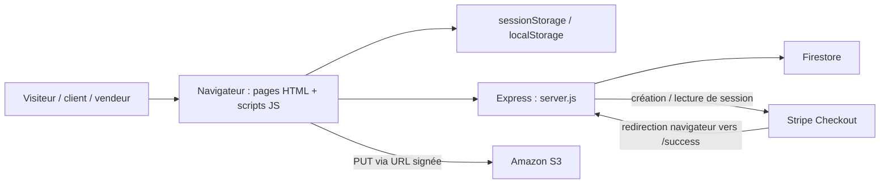

### Frontière de confiance observée

Le serveur accepte directement plusieurs valeurs contrôlées par le navigateur :

- l’adresse e-mail utilisée comme identité ;
- le statut vendeur demandé à l’inscription ou lors de la promotion vendeur ;
- l’identifiant du produit à lire, modifier ou supprimer ;
- le propriétaire déclaré d’un produit ;
- les noms, prix, quantités et images envoyés à Stripe ;
- le contenu de la commande placé dans l’URL de succès.

Aucun middleware d’authentification ou d’autorisation ne protège les routes métier.

## 3. Parcours utilisateur de bout en bout

Cette vue donne les grandes chaînes fonctionnelles. Chaque étape renvoie à une fiche d’exécution détaillée.

### P-01 — Créer un compte, se connecter puis se déconnecter

```text
[F-01 Inscription]
   ↓ crée users/{email} et une session navigateur locale
[F-02 Connexion]
   ↓ restaure profil, panier, wishlist et tags vendeur
Utilisation du site
   ↓ clic Log out
[F-03 Sauvegarde et déconnexion]
```

Fiches : [F-01](#f-01), [F-02](#f-02), [F-03](#f-03).

### P-02 — Trouver et acheter un vêtement

```text
[F-14 Chargement de l’accueil]
   ↓ clic carte ou recherche
[F-15 Recherche produit]
   ↓ clic carte
[F-04 Fiche produit → taille → ajout panier → affichage]
   ↓ boutons + / − / supprimer
[F-18 Modification du panier]
   ↓ lien Checkout
[F-05 Saisie de l’adresse et démarrage checkout]
   ↓ redirection Stripe puis retour /success
[F-06 Paiement et création de commande]
```

Fiches : [F-14](#f-14), [F-15](#f-15), [F-04](#f-04), [F-18](#f-18), [F-05](#f-05), [F-06](#f-06).

### P-03 — Mettre un produit en wishlist

```text
[F-04 Chargement de la fiche et choix de taille]
   ↓ clic Add to wishlist
[F-17 Ajout et affichage wishlist]
   ↓ ouverture /cart
Wishlist affichée sous le panier
```

Fiches : [F-04](#f-04), [F-17](#f-17).

Le code actif ne fournit aucun transfert wishlist → panier.

### P-04 — Devenir vendeur et ouvrir son catalogue

```text
[F-01 ou F-02 Compte client]
   ↓ ouverture /seller
[F-07 Devenir vendeur]
   ↓ rechargement de /seller
[F-08 Catalogue vendeur]
```

Fiches : [F-07](#f-07), [F-08](#f-08).

### P-05 — Gérer le cycle de vie d’un produit

```text
[F-08 Catalogue vendeur]
   ↓ Add product
[F-09 Création + envoi S3 + publication]
   ├── Save draft → [F-10 Brouillon]
   └── Add product → publication
          ↓ retour catalogue
[F-11 Modification]
   ↓ retrait/remplacement d’un média [F-19]
   ↓ éventuellement gestion des tags [F-13]
[F-12 Suppression Firestore + S3]
```

Fiches : [F-08](#f-08), [F-09](#f-09), [F-10](#f-10), [F-11](#f-11), [F-12](#f-12), [F-13](#f-13), [F-19](#f-19).

### Carte synthétique des parcours

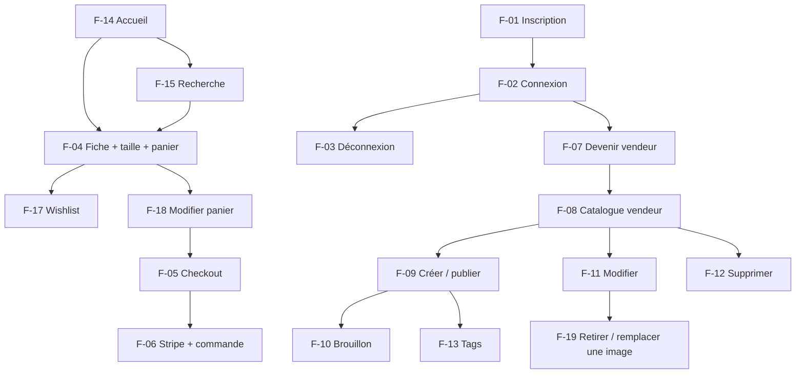

## 4. Cartographie des pages et scripts

| Page / route | Scripts principaux | Rôle fonctionnel | État |
|---|---|---|---|
| `/` | `nav.js` → `footer.js` → `homesliders.js` → script inline | Accueil et deux sélections par tags `men` et `women` | Actif |
| `/signup` | `token.js`, `form.js` | Création de compte | Actif |
| `/login` | `token.js`, `form.js` | Connexion et restauration des données locales | Actif |
| `/search/:key` | `nav.js` → `footer.js` → `homesliders.js` → `search.js` | Recherche exacte dans les tags produit | Actif |
| `/products/:id` | `nav.js` → `footer.js` → `homesliders.js` → `product.js` | Fiche produit, similaires, ajout panier/wishlist | Actif |
| `/cart` | `nav.js` → `footer.js` → `homesliders.js` → `cart.js` | Consultation et modification du panier et de la wishlist | Actif |
| `/checkout` | `nav.js` → `homesliders.js` → `cart.js` → `token.js` → `checkout.js` | Adresse, récapitulatif et démarrage du paiement | Partiel / défectueux |
| `/seller` | `token.js` → `createSellerCards.js` → `seller.js` | Inscription vendeur et catalogue du vendeur | Actif, contrôle uniquement côté navigateur |
| `/add-product` | `token.js` → `addProduct.js` → `bing5.js` | Création ou brouillon produit | Actif, contrôle uniquement côté navigateur |
| `/add-product/:id` | `token.js` → `addProduct.js` → `bing5.js` | Modification d’un produit | Actif, sans contrôle de propriété |
| `/404` | `nav.js` | Page de repli | Actif |
| `/mail.html` | Aucun | Maquette statique de confirmation | Accessible par `express.static`, mais non liée au parcours ; `/order` reste inactive |

### Consultation du catalogue

La consultation est détaillée dans F-04, F-14, F-15 et F-16.

1. L’accueil appelle `homesliders.js::getProducts("men")`, puis `homesliders.js::getProducts("women")`.
2. La recherche pilotée par `nav.js` transforme la saisie en `/search/{valeur}` ; `search.js` appelle ensuite `homesliders.js::getProducts(searchKey)`.
3. La fiche produit appelle `product.js::getProductDataId()`, qui envoie `{ id }` à `server.js::POST /get-products`.
4. Les similaires sont chargés par `product.js::getProductDataId()` en répétant `homesliders.js::getProducts(tag)` pour chaque tag.
5. `homesliders.js::createCard()`, `product.js::setData()` et `createSellerCards.js::createSellerCard()` injectent plusieurs champs avec `innerHTML`.

Conséquences :

- la recherche n’est pas une recherche plein texte par nom, marque ou description ;
- un brouillon peut être retourné par identifiant ou par tag, faute de filtre sur `draft` ;
- les données produit non fiables peuvent produire une XSS persistante ;
- les appels de produits similaires sont multipliés par le nombre de tags.

## 5. Carte des dépendances entre scripts

### Ordre réel des scripts par page

```text
index.html
├── nav.js
├── footer.js
├── homesliders.js
└── script inline → getProducts("men"), getProducts("women")

signup.html / login.html
├── token.js
└── form.js

product.html
├── nav.js
├── footer.js
├── homesliders.js
└── product.js

search.html
├── nav.js
├── footer.js
├── homesliders.js
└── search.js

cart.html
├── nav.js
├── footer.js
├── homesliders.js  ← chargé mais non appelé par cart.js
└── cart.js

checkout.html
├── nav.js
├── homesliders.js  ← chargé mais non appelé par cart.js/checkout.js
├── cart.js          ← s’exécute immédiatement
├── token.js         ← fournit showAlert() après cart.js
└── checkout.js

seller.html
├── token.js
├── createSellerCards.js
└── seller.js

addProduct.html
├── token.js
├── addProduct.js
└── bing5.js         ← lit sessionStorage immédiatement
```

### Graphe des appels inter-fichiers

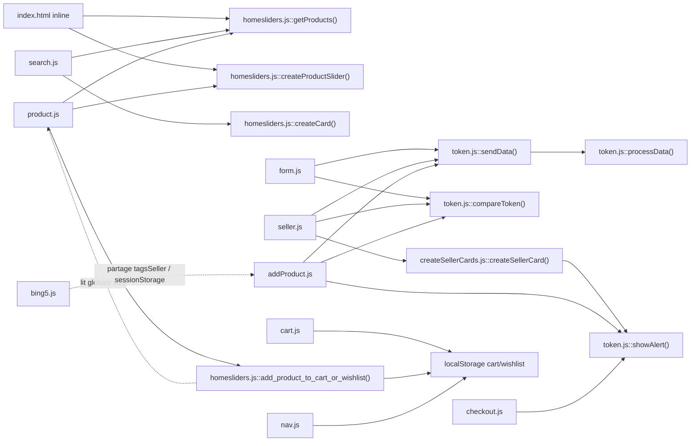

### Dépendances implicites à surveiller

| Consommateur | Fournisseur implicite | Élément utilisé | Pourquoi c’est fragile | Statut |
|---|---|---|---|---|
| `product.js` | `homesliders.js` | `getProducts`, `createProductSlider`, `add_product_to_cart_or_wishlist` | Aucun import ; l’ordre des `<script>` fait foi | 🟠 |
| `homesliders.js::add_product_to_cart_or_wishlist()` | `product.js` | Globale `size` | Le fichier fournisseur est pourtant chargé après le consommateur | 🟠 |
| `form.js`, `seller.js`, `addProduct.js` | `token.js` | `compareToken`, `sendData`, `showAlert`, `processData` | API globale commune à plusieurs pages et réponses | 🟠 |
| `token.js::processData()` | Script de page | Globale `loader` | `loader` n’est pas défini dans `token.js` | 🟠 |
| `seller.js::getProductSeller()` | `createSellerCards.js` | `createSellerCard` | Dépend de l’ordre `createSellerCards.js` avant `seller.js` | 🟠 |
| `createSellerCards.js::deleteItem()` | `token.js` | `showAlert` | Fonction d’alerte fournie globalement | 🟠 |
| `checkout.js` | `token.js` | `showAlert` | L’ordre est correct, mais la dépendance n’est pas déclarée | 🟠 |
| `bing5.js` | `sessionStorage.user` | `tagsSeller` | Lecture au chargement, avant le contrôle `window.onload` d’`addProduct.js` | 🔴 |
| `addProduct.js::validateForm()` | Propriété nommée du DOM | `discount` via l’élément `id="discount"` | Le script déclare `discountPercentage`, mais teste `discount.value` | 🟠 |
| `cart.js` | DOM de la page | `.cart`, `.wishlist`, `.bill` | `checkout.html` ne contient pas `.wishlist` | 🔴 |

### Fonctions et variables génériques ou ambiguës

Les noms suivants sont documentés sans modifier le code. Les noms futurs sont des **suggestions de refactorisation**.

| Élément actuel | Défini dans | Appelé / utilisé par | Responsabilité réelle | Problème de compréhension | Suggestion future |
|---|---|---|---|---|---|
| `addProduct.js::validateForm()` | `addProduct.js` | Gestionnaire clic `#add-btn` | Valide les champs d’une publication produit | Nom générique, distinct de la variable homonyme du checkout | `validatePublishableProductForm()` |
| `validateForm` | `checkout.js` | Gestionnaire clic `.place-order-btn` | Booléen indiquant que `checkout.js::getAddress()` a validé l’adresse au moins une fois | Le nom évoque une fonction ; reste `true` après une validation antérieure | `isCheckoutAddressValid` |
| `token.js::sendData()` | `token.js` | `form.js`, `seller.js`, `addProduct.js` | POST JSON générique, puis délègue toute réponse à `token.js::processData()` | Couplage transport + routage UI | `postFormAndDispatchResponse()` |
| `token.js::processData()` | `token.js` | Uniquement `token.js::sendData()` | Interprète quatre formes de réponses : alerte, profil, booléen vendeur, produit | Contrat implicite basé sur la forme des données | Handlers séparés par cas d’usage |
| `product.js::setData()` | `product.js` | `product.js::getProductDataId()` | Rend une fiche produit et installe ses événements | Nom trop vague | `renderProductDetailsAndBindActions()` |
| `addProduct.js::productData()` | `addProduct.js` | Clic publier et clic brouillon | Construit le payload et modifie aussi les tags de session | Nom nominal, mais effets de bord | `buildProductPayloadAndMergeSellerTags()` |
| `cart.js::setProducts()` | `cart.js` | Appels globaux pour `cart` et `wishlist` | Rend une liste, calcule le total et installe les événements | Trois responsabilités | `renderStoredList()` puis fonctions séparées |
| `user`, `loader`, `productId`, `data`, `imageLinks`, `tagsArray` | Plusieurs scripts / parfois sans déclaration | Globales de page | État partagé | Collision et provenance difficiles à suivre | Modules ou état explicitement encapsulé |

## 6. Inventaire des routes Express actives

### Pages HTML

| Méthode | Route | Fichier servi | Protection serveur |
|---|---|---|---|
| GET | `/` | `public/index.html` | Aucune |
| GET | `/signup` | `public/signup.html` | Aucune |
| GET | `/login` | `public/login.html` | Aucune |
| GET | `/seller` | `public/seller.html` | Aucune |
| GET | `/add-product` | `public/addProduct.html` | Aucune |
| GET | `/add-product/:id` | `public/addProduct.html` | Aucune |
| GET | `/products/:id` | `public/product.html` | Aucune |
| GET | `/search/:key` | `public/search.html` | Aucune |
| GET | `/cart` | `public/cart.html` | Aucune |
| GET | `/checkout` | `public/checkout.html` | Aucune |
| GET | `/404` | `public/404.html` | Aucune |

### API métier

| Méthode | Route | Entrée principale | Effet / sortie | Appel courant |
|---|---|---|---|---|
| POST | `/signup` | Profil, mot de passe, consentements, `seller` | Crée `users/{email}` avec mot de passe bcrypt | Handler `form.js` → `token.js::sendData()` |
| POST | `/login` | E-mail, mot de passe | Lit `users`, `saved`, `sellers` et renvoie le profil agrégé | Handler `form.js` → `token.js::sendData()` |
| POST | `/seller` | Informations vendeur et e-mail | Crée `sellers/{email}` puis passe `users/{email}.seller` à `true` | Handler `seller.js` → `token.js::sendData()` |
| GET | `/s3url` | Aucune | Renvoie une URL S3 pré-signée d’envoi | Handler image `addProduct.js` |
| POST | `/add-product` | Objet produit complet, éventuellement `draft` et `id` | Crée ou remplace `products/{id}` | Handlers publier/brouillon → `token.js::sendData()` |
| POST | `/get-products` | `id`, `tag` ou `email` | Lit un produit ou une liste de produits | `homesliders.js::getProducts()`, `product.js::getProductDataId()`, `seller.js::getProductSeller()`, `addProduct.js::fetchAddProductDataId()` |
| POST | `/delete-product` | `id` | Supprime les images S3 puis le document produit | `createSellerCards.js::deleteItem()` |
| POST | `/savecart` | E-mail, panier, wishlist, tags vendeur | Écrase `saved/{email}` et fusionne éventuellement les tags vendeur | Handler logout de `nav.js` |
| POST | `/getcartsaved` | E-mail | Lit `saved/{email}` | Actif mais non appelé par l’interface actuelle |
| POST | `/stripe-checkout` | Articles, adresse, e-mail | Crée une session Stripe et renvoie son URL | Handler `.place-order-btn` de `checkout.js` |
| GET | `/success` | `session_id` et commande sérialisée | Relit la session Stripe et tente de créer `order/{id}` | Redirection Stripe |

### Routes inactives à ne pas cartographier comme opérationnelles

| Route | Statut réel | Observation |
|---|---|---|
| POST `/order` | Inactif | Route entièrement commentée ; l’envoi d’e-mail Nodemailer associé ne s’exécute pas |
| POST `/tagsSeller` | Inactif | Route entièrement commentée |
| Anciennes versions de `/login`, `/savecart`, `/delete-product` | Inactif | Implémentations historiques commentées |

## 7. Modèle de données observé

### Firestore

| Collection | Identifiant du document | Données principales | Producteur / consommateur |
|---|---|---|---|
| `users` | E-mail | Nom, e-mail, hash du mot de passe, téléphone, consentements, indicateur `seller` | `/signup`, `/login`, `/seller` |
| `sellers` | E-mail | Nom commercial, adresse, description, téléphone, consentements, `tagsSeller` | `/seller`, `/login`, `/savecart` |
| `saved` | E-mail | `cart`, `wishlist` | `/savecart`, `/login`, `/getcartsaved` |
| `products` | Nom normalisé + suffixe aléatoire, ou ID fourni | Descriptions, images, tailles, prix, stock, tags, e-mail vendeur, brouillon | `/add-product`, `/get-products`, `/delete-product` |
| `order` | ID construit à partir du client et de la date | Corps transmis au checkout : articles, adresse, e-mail | `/success` |

### Stockage navigateur

| Stockage | Clé | Contenu | Durée / usage |
|---|---|---|---|
| `sessionStorage` | `user` | Nom, e-mail, rôle vendeur, tags vendeur, `authToken` local | Jusqu’à fermeture de l’onglet ou déconnexion |
| `localStorage` | `cart` | Lignes avec quantité, nom, prix, taille, description et image | Persistant, sauvegardé dans Firestore uniquement à la déconnexion |
| `localStorage` | `wishlist` | Même structure simplifiée que le panier | Persistant, sauvegardé dans Firestore uniquement à la déconnexion |

Le panier ne stocke ni identifiant produit ni identifiant de variante. Il est donc impossible pour le serveur de relire de manière fiable le catalogue, le stock ou le prix correspondant.

### Amazon S3

- Le serveur génère une URL pré-signée par image.
- Le navigateur envoie directement le fichier à S3.
- L’URL publique sans paramètres est conservée dans `products.images`.
- La suppression d’un produit tente de supprimer chaque objet S3 avant le document Firestore.
- Le remplacement, le retrait d’une image ou l’abandon d’un formulaire ne nettoie pas les objets devenus orphelins.

### Stripe

- Express crée une session Stripe Checkout à partir des articles fournis par le navigateur.
- La commande entière est sérialisée dans `success_url`.
- Stripe redirige le navigateur vers `/success`.
- Le serveur relit la session, mais ne valide pas explicitement le statut de paiement, le montant, la devise ou l’idempotence avant l’écriture de commande.
- Aucun webhook Stripe n’est présent.

## 8. Fiches fonctionnelles détaillées — GPS d’exécution

<a id="f-01"></a>

### F-01 — Inscription client

#### Objectif utilisateur

Créer un compte client et être immédiatement considéré comme connecté par l’interface.

#### Déclencheur exact

Clic `.submit-btn` dans `public/signup.html`.

#### Page de départ

`public/signup.html`.

#### Scripts chargés

Ordre exact : `token.js` → `form.js`. `form.js` utilise les fonctions globales déclarées par `token.js`.

#### Chemin d’exécution

```text
public/signup.html
   ↓ charge token.js puis form.js
form.js::window.onload (gestionnaire anonyme)
   ↓ si sessionStorage.user existe, appelle token.js::compareToken()
clic .submit-btn
   ↓ gestionnaire anonyme défini dans form.js
form.js détecte la page inscription grâce à la présence de #name
   ↓ validations navigateur
🟠 token.js::sendData("/signup", payload)
   ↓ fetch JSON
POST /signup
   ↓
🔵 server.js::POST /signup
   ↓ valide quelques champs
Firestore → users.doc(email).get()
   ↓ si l’e-mail est libre
bcrypt.genSalt() → bcrypt.hash(password)
   ↓
Firestore → users.doc(email).set(req.body)
   ↓ réponse { name, email, seller, cart: [], wishlist: [] }
🟠 token.js::processData(response)
   ↓ branche data.name
🔴 token.js::generateToken(email)
   ↓
sessionStorage["user"]
localStorage["cart"] = []
localStorage["wishlist"] = []
   ↓
location.replace("/")
```

#### Diagramme Mermaid

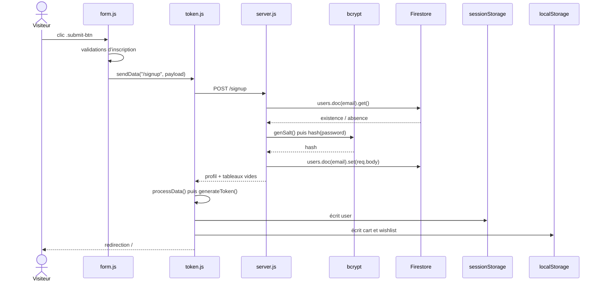

#### Tableau des fonctions

| Ordre | Fichier | Fonction / route | Entrée | Sortie / effet | Statut |
| ----: | ------- | ---------------- | ------ | -------------- | ------ |
| 1 | `form.js` | Gestionnaire anonyme `.submit-btn` | Champs du formulaire | Valide puis construit le payload | 🟢 Validation UI conservable ; 🟠 bifurcation signup/login implicite |
| 2 | `token.js` | `token.js::sendData()` | Route et payload | POST JSON puis appelle `processData` | 🟠 Trop générique |
| 3 | `server.js` | `server.js::POST /signup` | `req.body` | Valide, chiffre et crée le client | 🔴 Enregistre tout `req.body` ; 🔵 Customer/Auth Medusa |
| 4 | `bcrypt` | `bcrypt.genSalt()` / `bcrypt.hash()` | Mot de passe | Hash enregistré dans Firestore | 🟢 Protection du mot de passe |
| 5 | `token.js` | `token.js::processData()` | Réponse JSON | Déduit le type de réponse et crée l’état local | 🟠 Contrat implicite |
| 6 | `token.js` | `token.js::generateToken()` | E-mail | Fabrique `authToken` local | 🔴 Pas un jeton d’authentification ; 🔵 Auth Medusa |

#### Données manipulées

`name`, `email`, `password`, `number`, `tac`, `notification`, `seller`, `cart`, `wishlist`, `authToken`.

#### Stockages / services impliqués

- 🔵 Firestore `users/{email}` ;
- 🟢 bcrypt pour le mot de passe ;
- 🔴 `sessionStorage.user` comme pseudo-session ;
- 🔵 `localStorage.cart` et `localStorage.wishlist` initialisés côté client.

#### Dépendances transversales

- 🟠 `form.js` appelle `token.js::compareToken()`, `token.js::sendData()` et `token.js::showAlert()` sans import ;
- 🟠 `token.js::processData()` utilise la globale `loader` déclarée dans `form.js` ;
- 🟠 `form.js` distingue inscription et connexion par la présence de `#name`.

#### Problèmes identifiés

- 🔴 le serveur écrit `req.body` au complet ; un appel direct peut fournir `seller: true` même si l’interface envoie `false` ;
- 🔴 aucune session ou JWT n’est émis par le serveur ;
- 🟠 l’e-mail sert simultanément d’identifiant Firestore et d’identité métier, sans normalisation visible ;
- 🟠 aucune gestion d’erreur n’est attachée aux opérations Firestore/bcrypt de cette route ;
- 🔴 le pseudo-jeton est généré par le navigateur à partir d’une donnée publique.

#### Cible Medusa

- **Conservé dans le storefront** : formulaire et retours de validation.
- **Remplacé par Medusa** 🔵 : création Customer, Auth et session/JWT.
- **À supprimer** : `token.js::generateToken()` et le rôle `seller` accepté depuis le payload public.
- **Développé spécifiquement** : consentements et champs profil absents du modèle cible, si le besoin est confirmé.

#### Critères de validation de la migration

✅ À préserver :

- un visiteur doit pouvoir créer un compte avec les champs obligatoires valides ;
- une adresse déjà utilisée doit être refusée avec un message compréhensible ;
- un mot de passe invalide et les consentements obligatoires manquants doivent être signalés ;

🎯 À obtenir dans la cible :

- le mot de passe ne doit jamais être restitué ni stocké en clair ;
- après succès, le client doit être authentifié ou invité explicitement à se connecter selon l’UX retenue ;
- un nouvel inscrit ne doit pas obtenir de privilèges vendeur ou administrateur sans le workflow prévu.

<a id="f-02"></a>

### F-02 — Connexion et restauration

#### Objectif utilisateur

Se connecter et restaurer le profil, le panier, la wishlist et les tags vendeur sauvegardés.

#### Déclencheur exact

Clic `.submit-btn` dans `public/login.html`.

#### Page de départ

`public/login.html`.

#### Scripts chargés

Ordre exact : `token.js` → `form.js`.

#### Chemin d’exécution

```text
public/login.html
   ↓ charge token.js puis form.js
clic .submit-btn
   ↓ gestionnaire anonyme de form.js
form.js constate l’absence de #name
   ↓ valide email + password non vides
🟠 token.js::sendData("/login", { email, password })
   ↓
POST /login
   ↓
🔵 server.js::POST /login
   ↓ lance trois lectures en parallèle
Firestore → users.doc(email).get()
Firestore → saved.doc(email).get()
Firestore → sellers.doc(email).get()
   ↓ Promise.all()
bcrypt.compare(password, user.password)
   ↓ si succès
réponse { name, email, seller, tagsSeller, cart, wishlist }
   ↓
🟠 token.js::processData(response)
   ↓
🔴 token.js::generateToken(email)
   ↓ écrit profil et pseudo-jeton
sessionStorage["user"]
   ↓ remplace les listes locales
localStorage["cart"]
localStorage["wishlist"]
   ↓
location.replace("/")
```

#### Diagramme Mermaid

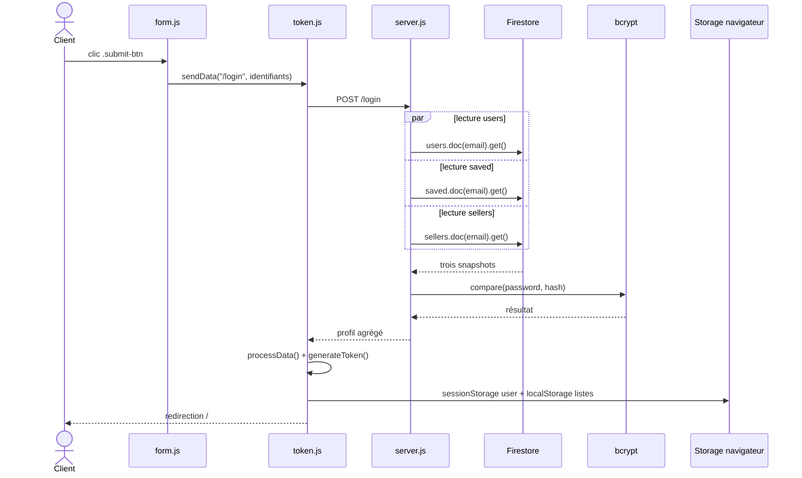

#### Tableau des fonctions

| Ordre | Fichier | Fonction / route | Entrée | Sortie / effet | Statut |
| ----: | ------- | ---------------- | ------ | -------------- | ------ |
| 1 | `form.js` | Gestionnaire anonyme `.submit-btn` | E-mail, mot de passe | Appelle `sendData` | 🟢 Simple ; 🟠 partage le handler d’inscription |
| 2 | `token.js` | `token.js::sendData()` | `/login`, identifiants | POST puis dispatch générique | 🟠 À séparer par cas d’usage |
| 3 | `server.js` | `server.js::POST /login` | E-mail, mot de passe | Agrège trois documents et vérifie bcrypt | 🟢 Lectures parallèles ; 🔵 Auth/Customer/Cart Medusa |
| 4 | `bcrypt` | `bcrypt.compare()` | Mot de passe, hash | Booléen de correspondance | 🟢 |
| 5 | `token.js` | `token.js::processData()` | Profil agrégé | Réécrit les stockages navigateur | 🟠 Effets multiples |
| 6 | `token.js` | `token.js::generateToken()` | E-mail | Produit le pseudo-jeton | 🔴 Rejet possible pour certaines adresses ; 🔵 Auth Medusa |

#### Données manipulées

`email`, `password`, `name`, `seller`, `tagsSeller`, `cart`, `wishlist`, `authToken`.

#### Stockages / services impliqués

- Firestore `users`, `saved`, `sellers` ;
- bcrypt ;
- `sessionStorage.user` ;
- `localStorage.cart` et `localStorage.wishlist`.

#### Dépendances transversales

- 🟠 mêmes dépendances globales `form.js` ↔ `token.js` que F-01 ;
- 🟠 la forme de la réponse détermine la branche de `token.js::processData()` ;
- la route active `/getcartsaved` n’intervient pas : la restauration est intégrée directement à `server.js::POST /login`.

#### Problèmes identifiés

- 🔴 `authToken` est fabriqué côté navigateur et n’est envoyé à aucune route métier ;
- 🔴 le caractère `1`, placé à l’index zéro de `char`, est remplacé par `char.length / 2` à cause de `char.indexOf(key[i]) || ...` ; le jeton peut ensuite échouer dans `token.js::compareToken()` ;
- 🔴 le serveur renvoie le rôle vendeur sans créer de session vérifiable pour les appels suivants ;
- 🟠 les listes Firestore remplacent toujours les listes locales ; aucune fusion n’est faite ;
- 🟠 les erreurs Firestore et bcrypt ne disposent pas d’un traitement complet.

#### Cible Medusa

- **Conservé dans le storefront** : formulaire, messages d’erreur et redirection.
- **Remplacé par Medusa** 🔵 : Auth JWT ou session cookie, récupération Customer et panier serveur.
- **À supprimer** : génération/comparaison du pseudo-jeton et identité fournie dans les corps de requête.
- **Suggestion** : définir explicitement la politique de fusion d’un panier invité avec le panier du client connecté.

#### Critères de validation de la migration

✅ À préserver :

- un client valide doit pouvoir se connecter avec son e-mail et son mot de passe ;
- des identifiants invalides doivent être refusés sans révéler d’information sensible ;
- un utilisateur déjà authentifié ne doit pas rester bloqué sur la page de connexion.

🎯 À obtenir dans la cible :

- l’identité et les droits utilisés après connexion doivent provenir du système d’authentification cible ;
- le panier associé au client doit être récupéré ou fusionné selon une règle métier décidée ;
- les préférences conservées doivent être restaurées sans écraser silencieusement des données utiles ;

<a id="f-03"></a>

### F-03 — Déconnexion et sauvegarde

#### Objectif utilisateur

Quitter sa session tout en sauvegardant panier, wishlist et éventuellement tags vendeur.

#### Déclencheur exact

Clic `#user-btn` après ouverture de la fenêtre de compte dans la navigation.

#### Page de départ

Toute page active chargeant `public/js/nav.js` : accueil, recherche, fiche produit, panier, checkout ou 404.

#### Scripts chargés

`nav.js` est le premier script de ces pages. Il exécute immédiatement `nav.js::createNav()`, puis son affectation `window.onload` configure le bouton après chargement.

#### Chemin d’exécution

```text
page HTML avec <nav class="navbar">
   ↓
🟢 nav.js::createNav()
   ↓ injecte #user-btn et la popup
nav.js::window.onload (gestionnaire anonyme)
   ↓ lit sessionStorage.user
   ↓ si utilisateur présent, installe le clic Log out
clic #user-btn
   ↓ construit dataToSend
localStorage["cart"] → cart ou null
localStorage["wishlist"] → wishlist ou null
sessionStorage["user"] → email
   ↓ si seller, ajoute tagsSeller
fetch POST /savecart
   ↓
🔵 server.js::POST /savecart
   ↓ toujours
Firestore → saved.doc(email).set({ cart, wishlist })
   ↓ si tagsSeller est truthy
Firestore → sellers.doc(email).set({ tagsSeller }, { merge: true })
   ↓ Promise.all()
réponse JSON "saved" ou message d’erreur
   ↓ sans distinguer le résultat
sessionStorage.clear()
localStorage.clear()
   ↓
location.replace("/")
```

#### Diagramme Mermaid

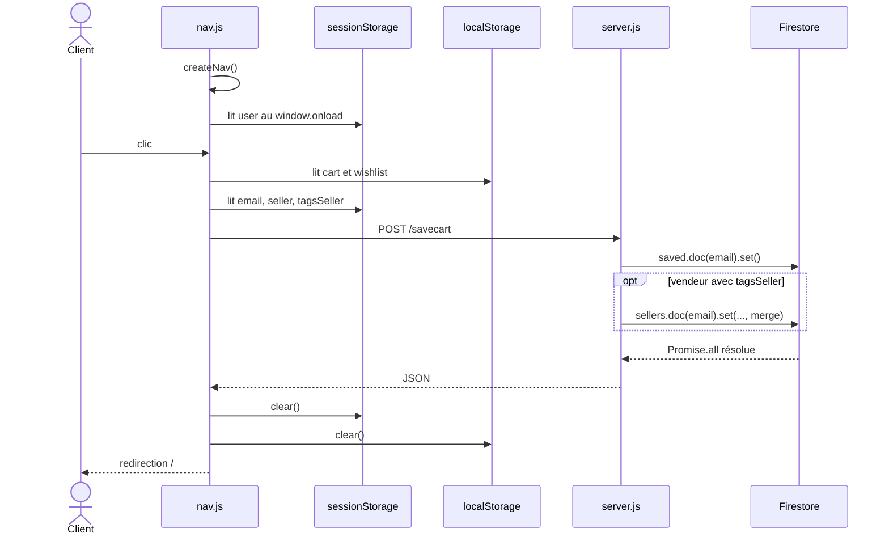

#### Tableau des fonctions

| Ordre | Fichier | Fonction / route | Entrée | Sortie / effet | Statut |
| ----: | ------- | ---------------- | ------ | -------------- | ------ |
| 1 | `nav.js` | `nav.js::createNav()` | `.navbar` | Injecte navigation et bouton utilisateur | 🟢 UI conservable ; 🟠 HTML par `innerHTML` |
| 2 | `nav.js` | `nav.js::window.onload` anonyme | `sessionStorage.user` | Configure login ou logout | 🟠 Affectation globale `window.onload` |
| 3 | `nav.js` | Gestionnaire anonyme `#user-btn` | Stockages navigateur | Envoie `/savecart` puis efface tout | 🔴 Efface même sur réponse d’erreur ; 🔵 panier Medusa |
| 4 | `server.js` | `server.js::POST /savecart` | E-mail, listes, tags | Écrit `saved` et éventuellement `sellers` | 🔴 Sans authentification ; 🔵 Cart/Customer Medusa |

#### Données manipulées

`email`, `seller`, `tagsSeller`, `cart`, `wishlist`, `dataToSend`.

#### Stockages / services impliqués

- `sessionStorage.user` ;
- `localStorage.cart`, `localStorage.wishlist` ;
- Firestore `saved/{email}` et `sellers/{email}`.

#### Dépendances transversales

- 🟠 `nav.js::createNav()` doit s’exécuter avant la sélection de `#user-btn` ;
- 🟠 les pages qui affecteraient ensuite `window.onload` pourraient remplacer le handler de `nav.js` ; aucune page actuelle chargée avec `nav.js` ne le fait, `checkout.js` utilisant `addEventListener("load", ...)` ;
- F-13 dépend de ce flux pour persister `tagsSeller` dans Firestore.

#### Problèmes identifiés

- 🔴 l’e-mail servant de clé Firestore vient du navigateur et n’est pas authentifié ;
- 🔴 une réponse JSON d’erreur déclenche quand même l’effacement des stockages et la redirection ;
- 🔴 `sessionStorage.clear()` et `localStorage.clear()` effacent toutes les clés du domaine ;
- 🟠 les modifications ne sont sauvegardées qu’au logout ; fermeture d’onglet ou panne réseau = perte possible ;
- 🟠 la route active `/getcartsaved` peut lire un autre e-mail et n’est appelée par aucune interface actuelle.

#### Cible Medusa

- **Conservé dans le storefront** : commande de déconnexion et retour visuel.
- **Remplacé par Medusa** 🔵 : persistance du panier et terminaison de session authentifiée.
- **À supprimer** : sauvegarde métier déclenchée uniquement par le logout et effacement global des stockages.
- **Développé spécifiquement** : persistance des préférences ou tags vendeur si le multi-vendeur est retenu.

#### Critères de validation de la migration

✅ À préserver :

- l’utilisateur doit pouvoir se déconnecter depuis la navigation ;

🎯 À obtenir dans la cible :

- la session authentifiée doit être réellement invalidée ou retirée côté client selon le mécanisme cible ;
- les données commerce persistantes, notamment le panier, ne doivent pas être perdues du seul fait de la déconnexion ;
- les données appartenant à d’autres fonctions du même domaine ne doivent pas être effacées globalement ;
- après déconnexion, les pages protégées doivent redemander une authentification ;
- une erreur de sauvegarde éventuelle doit être signalée sans prétendre que l’opération a réussi.

<a id="f-04"></a>

### F-04 — Fiche produit, choix de la taille, ajout et affichage du panier

#### Objectif utilisateur

Consulter un produit, choisir une taille, l’ajouter au panier puis vérifier la ligne et le total dans la page panier.

#### Déclencheur exact

Ouverture de `/products/:id`, clic sur un label `.size-radio-btn`, clic `.cart-btn`, puis ouverture de `/cart`.

#### Page de départ

`public/product.html`.

#### Scripts chargés

Ordre exact : `nav.js` → `footer.js` → `homesliders.js` → `product.js`. Cet ordre est obligatoire : `product.js::getProductDataId()` et `product.js::setData()` appellent des fonctions globales déclarées par `homesliders.js`.

La page d’arrivée `public/cart.html` charge : `nav.js` → `footer.js` → `homesliders.js` → `cart.js`.

#### Chemin d’exécution

```text
public/product.html
   ↓ charge nav.js, footer.js, homesliders.js, puis product.js
product.js (initialisation globale)
   ↓ extrait l’identifiant de location.pathname dans productId
🟢 product.js::getProductDataId()
   ↓ fetch
POST /get-products { id: productId }
   ↓
🔵 server.js::POST /get-products
   ↓ products.doc(id).get()
Firestore → collection products
   ↓ document produit JSON
🟢 product.js::setData(data)
   ↓ remplit images, tailles, textes et prix
   ↓ installe les gestionnaires anonymes sur .wishlist-btn et .cart-btn
   ├── clic panier/wishlist sans taille
   │   ↓ product.js::addRedClass() marque les boutons de taille
   │   ↓ aucun ajout au stockage
   └── taille choisie : poursuit ci-dessous
clic .size-radio-btn
   ↓ gestionnaire anonyme défini au niveau global de product.js
product.js met hasCheckedSize = true et size = item.innerHTML
   ↓
clic .cart-btn
   ↓ gestionnaire installé par product.js::setData()
🟠 appel inter-fichier
🔴 homesliders.js::add_product_to_cart_or_wishlist("cart", data)
   ↓ lit la variable globale size définie dans product.js
   ↓ copie item, name, sellPrice, size, shortDes et image
localStorage["cart"]
   ↓ navigation utilisateur vers /cart
public/cart.html
   ↓ charge nav.js, footer.js, homesliders.js, puis cart.js
🟢 cart.js::setProducts("cart")
   ↓ lit et parse localStorage["cart"]
🟢 cart.js::createSmallCards(data[i])
   ↓ produit le HTML de chaque ligne
🟢 cart.js::updateBill()
   ↓ affiche totalBill dans .bill
🟠 cart.js::setupEvents("cart")
   ↓ installe les gestionnaires quantité et suppression
cart.js::setProducts("wishlist")
   ↓ affiche aussi la wishlist dans la même page
```

#### Diagramme Mermaid

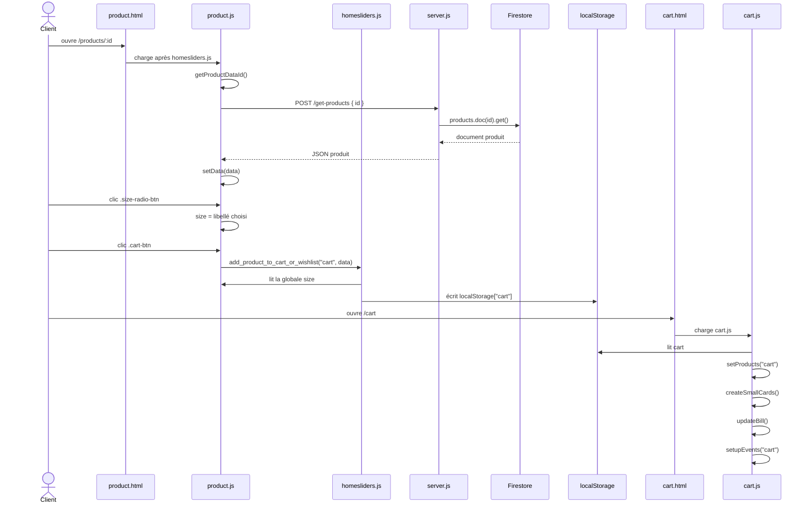

#### Tableau des fonctions

| Ordre | Fichier | Fonction / route | Entrée | Sortie / effet | Statut |
| ----: | ------- | ---------------- | ------ | -------------- | ------ |
| 1 | `product.js` | Initialisation globale | `location.pathname` | Définit `productId`, lance le chargement | 🟠 Dépend de l’URL et de globales |
| 2 | `product.js` | `product.js::getProductDataId()` | `productId` | `fetch()` vers `/get-products` | 🟢 Rôle clair ; 🔵 catalogue à remplacer |
| 3 | `server.js` | `server.js::POST /get-products` | `{ id }` | Lit et renvoie `products/{id}` | 🔴 Anonyme, sans filtre brouillon ; 🔵 Medusa Store API |
| 4 | `product.js` | `product.js::setData()` | Objet produit | Remplit la fiche et installe les clics panier/wishlist | 🟢 Rôle UI conservable ; 🔴 `innerHTML` non sûr |
| 5 | `product.js` | `product.js::addRedClass()` | Clic sans taille | Ajoute la classe `uncheck` aux tailles | 🟢 Retour visuel conservable |
| 6 | `product.js` | Gestionnaire anonyme `.size-radio-btn` | Label cliqué | Met à jour `hasCheckedSize`, `checkedBtn`, `size` | 🟠 État global à refactorer |
| 7 | `product.js` | Gestionnaire anonyme `.cart-btn` | Clic utilisateur, `data` fermé par closure | Appelle la fonction globale de panier | 🟠 Dépendance inter-fichier implicite |
| 8 | `homesliders.js` | `homesliders.js::add_product_to_cart_or_wishlist()` | `"cart"`, produit, globale `size` | Ajoute une copie simplifiée dans `localStorage` | 🔴 Prix modifiable et aucun ID ; 🔵 Cart Medusa |
| 9 | `cart.js` | `cart.js::setProducts("cart")` | Clé locale `cart` | Construit les lignes et le total | 🟢 Affichage conservable ; 🔴 plante si clé absente |
| 10 | `cart.js` | `cart.js::createSmallCards()` | Une ligne panier | Retourne une chaîne HTML | 🟠 Rendu couplé aux données ; 🔴 injection HTML possible |
| 11 | `cart.js` | `cart.js::updateBill()` | Globale `totalBill` | Met à jour `.bill` | 🟢 Rôle clair ; 🔵 total Medusa à utiliser |
| 12 | `cart.js` | `cart.js::setupEvents("cart")` | DOM des lignes + stockage local | Installe quantité et suppression | 🟠 Responsabilités multiples ; 🔵 mutations Cart Medusa |

#### Données manipulées

`productId`, `data`, `images`, `sizes`, `hasCheckedSize`, `checkedBtn`, `size`, `item`, `name`, `sellPrice`, `shortDes`, `image`, `cart`, `totalBill`.

#### Stockages / services impliqués

- 🔵 Firestore `products` pour charger le produit ;
- 🔴 `localStorage["cart"]` comme source du panier et des prix ;
- aucun contrôle de stock ni service serveur lors de l’ajout au panier.

#### Dépendances transversales

- 🟠 `product.js` utilise `homesliders.js::getProducts()`, `homesliders.js::createProductSlider()` et `homesliders.js::add_product_to_cart_or_wishlist()` grâce à l’ordre des `<script>` ;
- 🟠 `homesliders.js::add_product_to_cart_or_wishlist()` lit la variable globale `size` définie dans `product.js`, soit une dépendance inverse non déclarée ;
- 🟠 `cart.js` partage la globale `totalBill` entre l’affichage et les gestionnaires ;
- 🟠 `nav.js` et `footer.js` supposent la présence de `.navbar` et `footer` dans les pages où ils sont chargés.

#### Problèmes identifiés

- 🔴 la ligne panier ne contient ni identifiant produit ni identifiant de variante ;
- 🔴 le nom, le prix et l’image sont copiés depuis les données du navigateur puis restent modifiables ;
- 🔴 le serveur ne relit ni prix ni stock à l’ajout ;
- 🔴 les champs produit et panier sont injectés avec `innerHTML` ;
- 🟠 deux ajouts identiques créent deux lignes au lieu de fusionner la quantité ;
- 🔴 `cart.js::setProducts()` appelle `data.length` sans traiter le cas où la clé locale n’existe pas ;
- 🟠 la fonction générique traite à la fois panier et wishlist en dépendant d’une globale étrangère.

#### Cible Medusa

- **Conservé dans le storefront** : la fiche, le choix visuel d’une taille, le bouton et l’affichage du panier, après sécurisation du rendu.
- **Remplacé par Medusa** 🔵 : lecture catalogue, variante correspondant à la taille, création/mutation du panier, prix, quantité, stock et total.
- **À supprimer** : la copie métier du produit dans `localStorage` et la globale croisée `size`.
- **Suggestion de refactorisation** : isoler un adaptateur storefront dont les fonctions indiquent explicitement `addVariantToCart` et `renderCartLines`.

#### Critères de validation de la migration

✅ À préserver :

- la fiche d’un produit publiable doit pouvoir être affichée avec ses informations et médias ;
- l’utilisateur doit pouvoir sélectionner une taille ;
- une tentative d’ajout sans taille doit produire un retour visuel clair ;
- l’ajout au panier doit créer une ligne correspondant au bon produit et à la bonne variante ;
- la ligne ajoutée doit apparaître dans le panier avec un prix, une quantité et une image cohérents ;

🎯 À obtenir dans la cible :

- seules les variantes réellement disponibles doivent être proposées ;
- le total affiché doit correspondre aux données calculées par le système cible ;
- un brouillon ou un produit non publiable ne doit pas être accessible dans le storefront.

<a id="f-05"></a>

### F-05 — Checkout et adresse

#### Objectif utilisateur

Vérifier son panier, saisir une adresse de livraison et démarrer le paiement Stripe.

#### Déclencheur exact

Ouverture de `/checkout`, puis clic `.place-order-btn`.

#### Page de départ

`public/checkout.html`, généralement atteinte depuis le lien `.checkout-btn` de `public/cart.html`.

#### Scripts chargés

Ordre exact : `nav.js` → `homesliders.js` → `cart.js` → `token.js` → `checkout.js`.

`cart.js` s’exécute immédiatement avant `checkout.js`; il tente `setProducts("cart")` puis `setProducts("wishlist")`.

#### Chemin d’exécution

```text
public/checkout.html
   ↓ charge nav.js et homesliders.js
cart.js (exécution globale immédiate)
   ↓
cart.js::setProducts("cart")
   ↓ lit localStorage["cart"], rend les lignes et le total
🔴 cart.js::setProducts("wishlist")
   ↓ document.querySelector(".wishlist") retourne null
   ↓ erreur lors de l’accès à element.innerHTML
le parseur HTML poursuit ensuite les scripts suivants
   ↓ charge token.js puis checkout.js
checkout.js::window load (gestionnaire anonyme)
   ↓ si sessionStorage.user absent → location.replace("/login")
   ↓ traite aussi payment=done ou payment_fail=true
clic .place-order-btn
   ↓ gestionnaire anonyme de checkout.js
🟠 checkout.js::getAddress()
   ↓ lit #address, #street, #city, #state, #pincode, #landmark
   ↓ si valides, fixe la globale validateForm = true
   ↓
localStorage["cart"] + sessionStorage.user.email + address
   ↓ fetch
POST /stripe-checkout
   ↓ suite dans F-06
```

#### Diagramme Mermaid

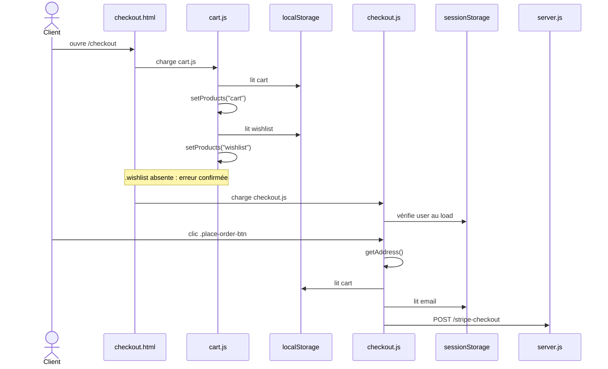

#### Tableau des fonctions

| Ordre | Fichier | Fonction / route | Entrée | Sortie / effet | Statut |
| ----: | ------- | ---------------- | ------ | -------------- | ------ |
| 1 | `cart.js` | `cart.js::setProducts("cart")` | Panier local | Rend récapitulatif et total | 🟢 UI conservable ; 🔵 Cart Medusa |
| 2 | `cart.js` | `cart.js::setProducts("wishlist")` | Wishlist locale, DOM | Accès à un élément inexistant | 🔴 Bug actif sur checkout |
| 3 | `checkout.js` | Gestionnaire `window.load` | Session et query string | Redirige ou affiche un message | 🔴 Confiance dans `payment=done` |
| 4 | `checkout.js` | `checkout.js::getAddress()` | Six champs DOM | Objet adresse ou `false`, modifie `validateForm` | 🟠 Nom générique/état global ; 🔵 adresse Cart Medusa |
| 5 | `checkout.js` | Gestionnaire `.place-order-btn` | Panier, adresse, e-mail | POST `/stripe-checkout` et redirection | 🔴 Données métier contrôlées client ; 🔵 Payment Medusa |

#### Données manipulées

`cart`, `item`, `sellPrice`, `totalBill`, `address`, `street`, `city`, `state`, `pincode`, `landmark`, `email`, `validateForm`.

#### Stockages / services impliqués

- 🔴 `localStorage.cart` comme source des lignes et du prix ;
- 🔴 `sessionStorage.user` comme preuve de connexion et source de l’e-mail ;
- Express `/stripe-checkout`, puis Stripe dans F-06.

#### Dépendances transversales

- 🔴 `cart.js` suppose `.cart`, `.wishlist` et `.bill`; `checkout.html` ne fournit pas `.wishlist` ;
- 🟠 `checkout.js` appelle `token.js::showAlert()` grâce à l’ordre des scripts ;
- 🟠 `checkout.js` partage le nom `validateForm` avec une fonction de `addProduct.js`, mais il s’agit ici d’un booléen global ;
- `homesliders.js` est chargé mais aucune fonction n’en est appelée dans le flux checkout courant.

#### Problèmes identifiés

- 🔴 l’exécution de `cart.js::setProducts("wishlist")` rencontre un conteneur absent ;
- 🔴 la présence de `sessionStorage.user` est le seul contrôle d’accès ;
- 🔴 le panier peut être vide ou altéré et l’adresse n’est pas validée côté serveur ;
- 🔴 après une première adresse valide, `validateForm` reste `true`; un clic ultérieur avec champs vides peut envoyer `address: false` ;
- 🔴 l’URL `/checkout?payment=done` déclenche localement le vidage/tentative de suppression du panier sans preuve de paiement ;
- 🟠 aucune méthode de livraison n’est collectée.

#### Cible Medusa

- **Conservé dans le storefront** : formulaire, récapitulatif et interactions UI.
- **Remplacé par Medusa** 🔵 : panier, adresse, e-mail, région, livraison, collection et session de paiement.
- **À supprimer** : validation par booléen global et transmission des prix depuis `localStorage`.
- **Développé spécifiquement** : mise en page et règles de validation propres au storefront.

#### Critères de validation de la migration

✅ À préserver :

- un client doit voir un récapitulatif cohérent de son panier avant paiement ;
- les champs d’adresse obligatoires doivent être validés à chaque tentative ;
- les étapes de livraison et de paiement requises doivent pouvoir être poursuivies sans erreur JavaScript.

🎯 À obtenir dans la cible :

- l’accès au checkout doit appliquer la politique d’authentification décidée ;
- une adresse devenue invalide après une première validation ne doit pas être envoyée ;
- le checkout doit refuser un panier vide, expiré ou devenu non achetable ;
- les prix, disponibilités et totaux affichés doivent provenir du système commerce cible ;

<a id="f-06"></a>

### F-06 — Paiement et création de commande

#### Objectif utilisateur

Payer le panier avec Stripe et obtenir une commande enregistrée.

#### Déclencheur exact

Suite du clic `.place-order-btn` de F-05, redirection vers Stripe, puis retour Stripe sur `GET /success`.

#### Page de départ

`public/checkout.html`; la page de paiement est hébergée par Stripe.

#### Scripts chargés

Sur la page de départ : `nav.js` → `homesliders.js` → `cart.js` → `token.js` → `checkout.js`. Le retour `/success` est traité directement par `server.js`, sans page ni script front intermédiaire.

#### Chemin d’exécution

```text
checkout.js (gestionnaire clic .place-order-btn)
   ↓ fetch avec items, address, email contrôlés par le navigateur
POST /stripe-checkout
   ↓
🔴 server.js::POST /stripe-checkout
   ↓ req.body.items.map()
   ↓ crée line_items avec item.name, item.shortDes, item.image,
     item.sellPrice * 100 et item.item
Stripe → checkout.sessions.create({ mode: "payment", currency: "usd" })
   ↓ success_url contient session_id + JSON.stringify(req.body) encodé
   ↓ cancel_url = /checkout?payment_fail=true
Stripe renvoie session.url
   ↓ réponse JSON
checkout.js redirige location.href vers Stripe
   ↓ paiement / retour navigateur
GET /success?session_id=...&order=...
   ↓
🔴 server.js::GET /success
   ↓
Stripe → checkout.sessions.retrieve(session_id)
   ↓ session
customer = session.customer_details.email
   ↓ bug : lit ensuite customer.email
Firestore → order.doc(docName).set(JSON.parse(order))
   ↓ si écriture résolue
redirect /checkout?payment=done
   ↓
checkout.js::window load (gestionnaire anonyme)
   ↓ met cart à [] puis tente delete localStorage.cart
   ↓ token.js::showAlert("order is placed", "success")
```

#### Diagramme Mermaid

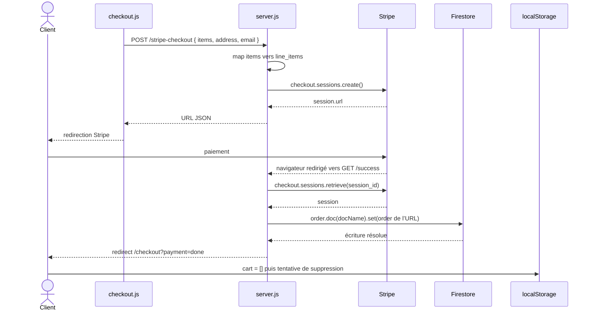

#### Tableau des fonctions

| Ordre | Fichier | Fonction / route | Entrée | Sortie / effet | Statut |
| ----: | ------- | ---------------- | ------ | -------------- | ------ |
| 1 | `checkout.js` | Gestionnaire `.place-order-btn` | Panier, adresse, e-mail | Appelle `/stripe-checkout`, redirige | 🔴 Données de confiance côté client ; 🔵 Medusa |
| 2 | `server.js` | `server.js::POST /stripe-checkout` | `req.body.items` | Crée une session Stripe | 🔴 Prix non relu ; 🔵 Payment Provider Medusa |
| 3 | Stripe | `checkout.sessions.create()` | `line_items`, URLs | Session et URL hébergée | 🟢 Service externe adapté, intégration à remplacer |
| 4 | `server.js` | `server.js::GET /success` | `session_id`, `order` | Relit Stripe et écrit une commande | 🔴 Vérification et identifiant défectueux ; 🔵 Order Medusa |
| 5 | Stripe | `checkout.sessions.retrieve()` | ID de session | Détails de session | 🟢 Appel réel ; 🔴 résultat insuffisamment contrôlé |
| 6 | `checkout.js` | Gestionnaire `window.load` | `payment=done` | Vide/tente de supprimer le panier et affiche succès | 🔴 Paramètre URL considéré comme preuve |

#### Données manipulées

`items`, `item`, `name`, `shortDes`, `image`, `sellPrice`, `address`, `email`, `session.url`, `session_id`, `order`, `customer`, `docName`, `payment`.

#### Stockages / services impliqués

- Stripe Checkout ;
- Firestore `order/{docName}` ;
- `localStorage.cart` ;
- données personnelles encodées dans la query string de `success_url`.

#### Dépendances transversales

- F-06 accepte le payload produit par F-04/F-05 sans relire `products` ;
- 🟠 la valeur `DOMAIN` et la clé Stripe proviennent de l’environnement, dont la présence n’est pas validée au démarrage ;
- `token.js::showAlert()` fournit l’alerte de retour ;
- la route `POST /order` et l’envoi Nodemailer sont commentés : ils ne participent pas à ce flux.

#### Problèmes identifiés

- 🔴 prix, quantité, nom et image viennent de `localStorage` ; aucun prix catalogue ni stock n’est relu ;
- 🔴 commande et adresse complètes transitent dans l’URL de succès ;
- 🔴 `server.js::GET /success` ne contrôle pas explicitement `payment_status`, montant, devise ou correspondance avec le payload ;
- 🔴 aucun webhook signé et aucune clé d’idempotence ne protègent la création de commande ;
- 🔴 `customer` est une chaîne e-mail, puis `customer.email` vaut `undefined`; `docName` commence vraisemblablement par `undefined-order-` ;
- 🔴 le `catch` envoie `res.json()` puis tente `res.redirect()`, soit deux réponses ;
- 🔴 une visite directe de `/checkout?payment=done` déclenche l’état de succès local.

#### Cible Medusa

- **Conservé dans le storefront** : bouton, redirection/éléments Stripe et page de confirmation.
- **Remplacé par Medusa** 🔵 : calculs du panier, Payment Module, fournisseur Stripe, complétion du panier et Order.
- **À supprimer** : commande sérialisée dans l’URL, route `/success` artisanale et confiance dans les prix navigateur.
- **Développé spécifiquement** : présentation de confirmation et éventuelles notifications métier.

#### Critères de validation de la migration

✅ À préserver :

- le client doit pouvoir être redirigé vers Stripe pour effectuer son paiement ;
- une page de confirmation doit rester présentée après un paiement réussi.

🎯 À obtenir dans la cible :

- le montant transmis à Stripe doit être calculé par le système cible ;
- un paiement réussi doit produire au plus une commande pour la même opération ;
- un paiement annulé ou échoué ne doit pas créer de commande payée ni vider abusivement le panier ;
- la commande doit contenir les bonnes lignes, quantités, montants, devise, client et adresse ;
- le statut affiché au retour doit refléter l’état réel du paiement ;
- la commande et les données personnelles ne doivent pas être transportées intégralement dans l’URL ;
- une confirmation de commande doit être consultable après succès, même si le navigateur recharge la page.

<a id="f-07"></a>

### F-07 — Devenir vendeur

#### Objectif utilisateur

Transformer son compte client en compte vendeur afin d’accéder au catalogue vendeur.

#### Déclencheur exact

Ouverture de `/seller`, clic `#apply-btn`, saisie du formulaire, puis clic `#apply-form-btn`.

#### Page de départ

`public/seller.html`.

#### Scripts chargés

Ordre exact : `token.js` → `createSellerCards.js` → `seller.js`.

#### Chemin d’exécution

```text
public/seller.html
   ↓ charge token.js, createSellerCards.js, seller.js
seller.js (initialisation globale)
   ↓ lit sessionStorage.user dans user
seller.js::window.onload (gestionnaire anonyme)
   ↓
🔴 token.js::compareToken(user.authToken, user.email)
   ↓ si user.seller est false
affiche .become-seller
   ↓ clic #apply-btn
affiche .apply-form
   ↓ clic #apply-form-btn
seller.js valide les champs et consentements
   ↓
🟠 token.js::sendData("/seller", payload + email de sessionStorage)
   ↓
POST /seller
   ↓
🔴 server.js::POST /seller
   ↓
Firestore → sellers.doc(email).set(req.body)
   ↓
Firestore → users.doc(email).update({ seller: true })
   ↓ réponse true
🟠 token.js::processData(true)
   ↓ branche data == true
sessionStorage.user.seller = true
sessionStorage.user.tagsSeller = []
   ↓ location.reload()
seller.js::window.onload
   ↓ seller est true
seller.js::getProductSeller() → F-08
```

#### Diagramme Mermaid

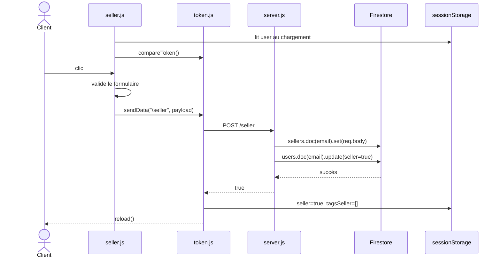

#### Tableau des fonctions

| Ordre | Fichier | Fonction / route | Entrée | Sortie / effet | Statut |
| ----: | ------- | ---------------- | ------ | -------------- | ------ |
| 1 | `seller.js` | `seller.js::window.onload` anonyme | Profil local | Contrôle pseudo-jeton et affiche le bon écran | 🔴 Autorisation client uniquement |
| 2 | `token.js` | `token.js::compareToken()` | Jeton local, e-mail | Booléen | 🔴 Ne prouve rien au serveur ; 🔵 Auth Medusa |
| 3 | `seller.js` | Gestionnaire `#apply-form-btn` | Informations commerciales | Valide puis appelle `sendData` | 🟢 UI conservable |
| 4 | `token.js` | `token.js::sendData()` | `/seller`, payload | POST et dispatch | 🟠 Générique |
| 5 | `server.js` | `server.js::POST /seller` | Informations + e-mail | Crée vendeur et promeut l’utilisateur | 🔴 Sans authentification ; 🔵 ou extension marketplace |
| 6 | `token.js` | `token.js::processData()` | `true` | Modifie le profil local et recharge | 🟠 Réponse booléenne implicite |

#### Données manipulées

`name`, `address`, `about`, `number`, `tac`, `legit`, `email`, `seller`, `tagsSeller`, `authToken`.

#### Stockages / services impliqués

- `sessionStorage.user` ;
- Firestore `sellers/{email}` et `users/{email}`.

#### Dépendances transversales

- `seller.js` dépend de `token.js::compareToken()`, `token.js::sendData()` et `token.js::showAlert()` ;
- `token.js::processData()` dépend de la globale `loader` déclarée dans `seller.js` ;
- après rechargement, le relais passe à `seller.js::getProductSeller()` documenté en F-08.

#### Problèmes identifiés

- 🔴 aucune session serveur ne lie la requête au compte ;
- 🔴 un appel direct peut promouvoir l’e-mail d’un autre utilisateur ;
- 🔴 le formulaire est immédiatement accepté : aucun statut d’examen, validation ou refus ;
- 🟠 `sellers.doc(email).set(req.body)` stocke le payload complet ;
- 🟠 si la première écriture réussit mais l’update `users` échoue, l’état devient incohérent.

#### Cible Medusa

- **Décision préalable** : mono-marchand ou marketplace.
- **Mono-marchand** 🔵 : remplacer par les comptes Admin Medusa ; ce parcours public disparaît.
- **Marketplace** : développer spécifiquement candidature, validation, vendeur et autorisations de ressources.
- **Conservé** : formulaire uniquement si un vrai onboarding vendeur est retenu.

#### Critères de validation de la migration

⚪ Critères applicables uniquement si la fonctionnalité d’inscription vendeur est conservée.

✅ À préserver :

- un client authentifié doit pouvoir soumettre une candidature vendeur avec les informations requises ;

🎯 À obtenir dans la cible :

- une candidature ne doit jamais accorder automatiquement des droits non validés ;
- l’utilisateur doit connaître l’état de sa demande : soumise, acceptée ou refusée ;
- seul le compte concerné doit pouvoir consulter ou compléter sa candidature ;
- l’acceptation doit accorder uniquement le périmètre vendeur prévu, sans privilège administrateur global.

<a id="f-08"></a>

### F-08 — Catalogue vendeur

#### Objectif utilisateur

Voir tous les produits rattachés à son e-mail vendeur et accéder aux actions créer, ouvrir, modifier ou supprimer.

#### Déclencheur exact

Ouverture ou rechargement de `/seller` avec `sessionStorage.user.seller === true`.

#### Page de départ

`public/seller.html`.

#### Scripts chargés

Ordre exact : `token.js` → `createSellerCards.js` → `seller.js`. L’ordre place `createSellerCards.js::createSellerCard()` avant son appel par `seller.js`.

#### Chemin d’exécution

```text
public/seller.html
   ↓
seller.js::window.onload (gestionnaire anonyme)
   ↓ lit user et appelle token.js::compareToken()
   ↓ si user.seller est true
🟢 seller.js::getProductSeller()
   ↓ fetch avec { email: user.email }
POST /get-products
   ↓
🔵 server.js::POST /get-products
   ↓ aucun id, aucun tag → requête par email
Firestore → products.where("email", "==", email).get()
   ↓ ajoute item.id à chaque donnée
réponse tableau ou chaîne "no products"
   ↓
seller.js affiche .product-listing
   ├── "no products" → affiche .no-product-image
   └── tableau → forEach
       ↓
🟠 createSellerCards.js::createSellerCard(product)
   ↓ injecte carte avec badge draft et trois actions
clic Edit → /add-product/:id → F-11
clic Open → /products/:id → F-04/F-16
clic Delete → createSellerCards.js::openDeletePopup() → F-12
```

#### Diagramme Mermaid

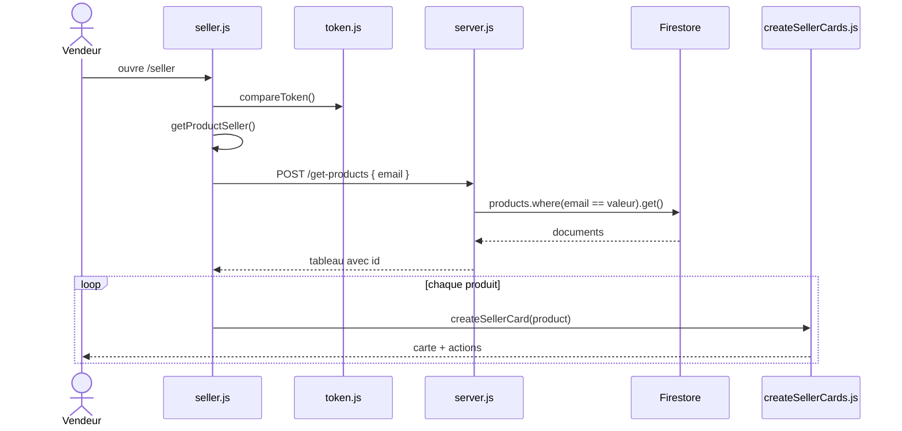

#### Tableau des fonctions

| Ordre | Fichier | Fonction / route | Entrée | Sortie / effet | Statut |
| ----: | ------- | ---------------- | ------ | -------------- | ------ |
| 1 | `seller.js` | `seller.js::window.onload` | Profil local | Autorise l’appel selon le pseudo-jeton/rôle | 🔴 Contrôle client seulement |
| 2 | `seller.js` | `seller.js::getProductSeller()` | `user.email` | POST et rendu du résultat | 🟢 Intention claire ; 🔴 identité non fiable |
| 3 | `server.js` | `server.js::POST /get-products` branche `email` | E-mail | Requête Firestore et tableau | 🔴 Sans autorisation ; 🔵 Product/Admin Medusa |
| 4 | `createSellerCards.js` | `createSellerCards.js::createSellerCard()` | Produit | Ajoute une carte HTML | 🟠 Dépendance globale ; 🔴 injection HTML |
| 5 | `createSellerCards.js` | `createSellerCards.js::openDeletePopup()` | ID produit | Prépare la confirmation | 🟠 Accumule des listeners |

#### Données manipulées

`user`, `email`, `product`, `id`, `draft`, `images`, `name`, `shortDes`, `sellPrice`, `actualPrice`.

#### Stockages / services impliqués

- `sessionStorage.user` ;
- Firestore `products` ;
- DOM `.product-listing`, `.product-container`.

#### Dépendances transversales

- `seller.js` dépend de `token.js::compareToken()` et `createSellerCards.js::createSellerCard()` ;
- les boutons créés par `createSellerCards.js::createSellerCard()` raccordent directement F-11, F-04/F-16 et F-12 ;
- la réponse spéciale chaîne `"no products"` constitue un contrat non typé entre `server.js` et `seller.js`.

#### Problèmes identifiés

- 🔴 e-mail, rôle et jeton sont contrôlés dans le navigateur ;
- 🔴 aucune vérification serveur ne prouve que le demandeur est ce vendeur ;
- 🔴 les champs Firestore sont interpolés dans `innerHTML` ;
- 🔴 aucune exclusion des brouillons : le bouton Open ouvre aussi leur fiche publique ;
- 🟠 le même endpoint `/get-products` porte trois responsabilités selon `id`, `tag` ou `email`.

#### Cible Medusa

- **Mono-marchand** 🔵 : remplacer par la liste Produits de Medusa Admin.
- **Marketplace** : développer une interface vendeur et des routes filtrées par le vendeur authentifié.
- **Conservé** : design des cartes seulement si une interface personnalisée demeure utile.
- **À supprimer** : sélection du propriétaire via un e-mail fourni dans le body.

#### Critères de validation de la migration

⚪ Critères applicables à l’espace vendeur personnalisé uniquement si cette fonctionnalité est conservée ; en mono-marchand, le résultat équivalent peut être fourni par Medusa Admin.

✅ À préserver :

- l’opérateur doit pouvoir consulter la liste des produits gérés ;
- produits publiés et brouillons doivent être distingués clairement ;
- les actions créer, ouvrir, modifier et retirer doivent être accessibles selon les droits ;

🎯 À obtenir dans la cible :

- un opérateur autorisé doit voir uniquement la liste des produits de son périmètre ;
- un vendeur ne doit jamais voir ni modifier les produits d’un autre vendeur ;
- un état vide et les erreurs de chargement doivent être affichés proprement ;
- l’ouverture d’un brouillon ne doit pas le rendre visible dans le storefront public.

<a id="f-09"></a>

### F-09 — Création et publication d’un produit

#### Objectif utilisateur

Créer un produit, envoyer ses images, renseigner les données commerciales et le publier.

#### Déclencheur exact

Ouverture de `/add-product`, changements sur les champs image, puis clic `#add-btn`.

#### Page de départ

`public/addProduct.html`.

#### Scripts chargés

Ordre exact : `token.js` → `addProduct.js` → `bing5.js`.

#### Chemin d’exécution

```text
public/addProduct.html
   ↓ charge token.js puis addProduct.js
addProduct.js::window.onload (gestionnaire anonyme)
   ↓ contrôle seulement user + token.js::compareToken(), pas user.seller
changement .fileupload
   ↓ gestionnaire anonyme addProduct.js
GET /s3url
   ↓
🔴 server.js::GET /s3url
   ↓
🟠 server.js::generateUrl()
   ↓ crée une URL signée putObject ContentType image/jpeg
S3 renvoie l’URL signée
   ↓ navigateur
PUT direct vers S3 avec Content-Type multipart/form-data
   ↓
addProduct.js remplit imagePaths[index]
   ↓
🟢 addProduct.js::updateDeleteButtonVisibility()
   ↓
bing5.js se charge, lit tagsSeller et appelle bing5.js::updateTagList()
   ↓ utilisateur remplit prix, tailles, stock, tags
clic #add-btn
   ↓
🟢 addProduct.js::storeSizes()
   ↓
🟠 addProduct.js::validateForm()
   ↓ si true
🟠 addProduct.js::productData()
   ↓ fusionne tags et modifie sessionStorage.user.tagsSeller
🟠 token.js::sendData("/add-product", data)
   ↓
POST /add-product
   ↓
🔴 server.js::POST /add-product
   ↓ validations serveur si draft absent
   ↓ docName = nom minuscule + entier [0..4999]
Firestore → products.doc(docName).set(req.body)
   ↓ réponse { product: name }
token.js::processData()
   ↓ branche data.product
location.href = "/seller"
```

#### Diagramme Mermaid

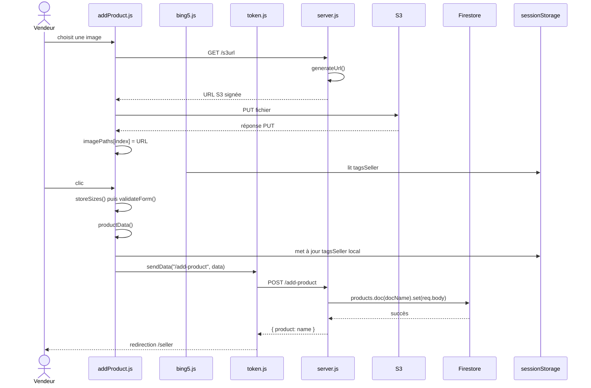

#### Tableau des fonctions

| Ordre | Fichier | Fonction / route | Entrée | Sortie / effet | Statut |
| ----: | ------- | ---------------- | ------ | -------------- | ------ |
| 1 | `addProduct.js` | Gestionnaire `.fileupload` | Fichier | Demande URL, PUT S3, met à jour `imagePaths` | 🟠 Responsabilités multiples ; 🔵 File Module |
| 2 | `server.js` | `server.js::GET /s3url` | Aucune | Renvoie une URL d’upload | 🔴 Anonyme ; 🔵 File Module Medusa |
| 3 | `server.js` | `server.js::generateUrl()` | Aucune | URL S3 `putObject` | 🟠 Nom générique ; 🔵 fournisseur S3 |
| 4 | `addProduct.js` | `addProduct.js::storeSizes()` | Cases cochées | Remplit la globale `sizes` | 🟢 Clair ; 🟠 état global |
| 5 | `addProduct.js` | `addProduct.js::validateForm()` | Champs/globale images/sizes | `true` ou alerte | 🟠 Nom générique ; 🔴 validation image incorrecte |
| 6 | `addProduct.js` | `addProduct.js::productData()` | Formulaire + session | Payload produit et mise à jour tags session | 🟠 Effet de bord et globale `data` implicite |
| 7 | `token.js` | `token.js::sendData()` | `/add-product`, produit | POST puis dispatch | 🟠 Générique |
| 8 | `server.js` | `server.js::POST /add-product` | Produit complet | Crée/remplace un document | 🔴 Sans autorisation ; 🔵 Product Medusa |
| 9 | `token.js` | `token.js::processData()` | `{ product }` | Redirige `/seller` | 🟠 Contrat par forme |

#### Données manipulées

`file`, `imagePaths`, `name`, `shortDes`, `des`, `sizes`, `actualPrice`, `discount`, `sellPrice`, `stock`, `tags`, `tac`, `email`, `tagsSeller`, `docName`.

#### Stockages / services impliqués

- Amazon S3 ;
- Firestore `products` ;
- `sessionStorage.user.tagsSeller` ;
- Express `/s3url` et `/add-product`.

#### Dépendances transversales

- `addProduct.js` dépend de `token.js::compareToken()`, `token.js::sendData()` et `token.js::showAlert()` ;
- `bing5.js` dépend de `sessionStorage.user.tagsSeller` et partage le champ `#selected` avec `addProduct.js` ;
- 🟠 `bing5.js` s’exécute immédiatement avant le `window.onload` de contrôle d’accès ;
- `token.js::processData()` lit la globale `loader` déclarée dans `addProduct.js`.

#### Problèmes identifiés

- 🔴 aucun middleware ne protège `/s3url` ou `/add-product` ; le rôle vendeur n’est même pas vérifié dans `addProduct.js::window.onload` ;
- 🔴 `[null, null, null, null]` a une longueur de 4 et passe le contrôle d’image ;
- 🔴 signature S3 `image/jpeg` mais envoi `multipart/form-data` ;
- 🔴 upload S3 effectué avant sauvegarde : abandon ou erreur crée des objets orphelins ;
- 🔴 e-mail propriétaire fourni par le navigateur ;
- 🔴 seulement 5 000 suffixes possibles par nom, et `.set()` écrase en cas de collision ;
- 🟠 `addProduct.js::productData()` assigne `data` sans déclaration et suppose `tagsSeller` non nul ;
- 🟠 `addProduct.js::validateForm()` teste `discount.value` sans variable `discount` déclarée ; le fonctionnement dépend de l’exposition historique des IDs HTML comme propriétés globales ;
- 🔴 prix en chaînes, devise absente, tailles sans variantes et stock global.

#### Cible Medusa

- **Conservé dans le storefront** : uniquement si la gestion produit reste une UI personnalisée ; sinon utiliser l’Admin.
- **Remplacé par Medusa** 🔵 : Product, options, variantes, prix, SKU, Inventory et File Module/S3.
- **À supprimer** : URL S3 publique anonyme, identifiant aléatoire artisanal, propriété par e-mail du body.
- **Développé spécifiquement** : isolation vendeur uniquement si marketplace retenue.

#### Critères de validation de la migration

✅ À préserver :

- l’interface retenue doit permettre de saisir les informations obligatoires d’un produit ;
- l’opérateur doit pouvoir sélectionner les médias à associer au produit ;
- l’opérateur doit pouvoir définir les options de taille ;
- une publication invalide doit être refusée avec des erreurs exploitables.

🎯 À obtenir dans la cible :

- seul un opérateur autorisé doit pouvoir créer le produit ;
- les médias sélectionnés doivent être envoyés et associés au bon produit ;
- les options de taille doivent produire des variantes cohérentes ;
- prix, devise, SKU et stock doivent être associés au bon niveau de variante ;
- une création réussie doit apparaître dans l’outil de gestion et dans le storefront seulement si son statut le permet ;
- une erreur partielle ne doit pas laisser un produit publié incohérent ni des fichiers orphelins silencieux.

<a id="f-10"></a>

### F-10 — Enregistrement d’un brouillon

#### Objectif utilisateur

Conserver un produit incomplet sans satisfaire les règles de publication.

#### Déclencheur exact

Clic `#save-btn` dans `public/addProduct.html`.

#### Page de départ

`public/addProduct.html` ou `/add-product/:id` pour transformer/remplacer un produit existant en brouillon.

#### Scripts chargés

Ordre exact : `token.js` → `addProduct.js` → `bing5.js`.

#### Chemin d’exécution

```text
clic #save-btn
   ↓ gestionnaire anonyme addProduct.js
🟢 addProduct.js::storeSizes()
   ↓ vérifie uniquement productName non vide
🟠 addProduct.js::productData()
   ↓ construit toutes les données disponibles
data.draft = true
   ↓ si URL /add-product/:id, data.id = productId
🟠 token.js::sendData("/add-product", data)
   ↓
POST /add-product
   ↓
🔴 server.js::POST /add-product
   ↓ if (!draft) est faux : validations de publication sautées
Firestore → products.doc(docName ou id).set(req.body)
   ↓ réponse { product: name }
token.js::processData()
   ↓ location.href = "/seller"
F-08 affiche la carte avec badge Draft
   ↓ mais les routes publiques ne filtrent pas draft
```

#### Diagramme Mermaid

```mermaid
sequenceDiagram
    actor Vendeur
    participant A as addProduct.js
    participant T as token.js
    participant E as server.js
    participant DB as Firestore
    participant S as seller.js

    Vendeur->>A: clic #save-btn
    A->>A: storeSizes()
    A->>A: vérifie seulement le nom
    A->>A: productData(); draft=true
    A->>T: sendData("/add-product", data)
    T->>E: POST /add-product
    E->>E: saute la validation si draft
    E->>DB: products.doc(id).set(req.body)
    DB-->>E: succès
    E-->>T: { product: name }
    T-->>Vendeur: /seller
    S-->>Vendeur: carte marquée Draft
```

#### Tableau des fonctions

| Ordre | Fichier | Fonction / route | Entrée | Sortie / effet | Statut |
| ----: | ------- | ---------------- | ------ | -------------- | ------ |
| 1 | `addProduct.js` | Gestionnaire `#save-btn` | Formulaire | Vérifie le nom, marque `draft` | 🟢 Intention claire ; 🟠 validation minimale |
| 2 | `addProduct.js` | `addProduct.js::storeSizes()` | Cases taille | Globale `sizes` | 🟢 |
| 3 | `addProduct.js` | `addProduct.js::productData()` | Formulaire/session | Payload + effet sur tags | 🟠 Peut échouer si `tagsSeller` nul |
| 4 | `server.js` | `server.js::POST /add-product` branche `draft` | Produit brouillon | Écrit sans validation complète | 🔴 Même route/collection que publié ; 🔵 Product status Medusa |
| 5 | `token.js` | `token.js::processData()` | `{ product }` | Retour catalogue | 🟠 |

#### Données manipulées

Toutes les données produit disponibles, plus `draft: true` et éventuellement `id`.

#### Stockages / services impliqués

- Firestore `products` ;
- `sessionStorage.user.tagsSeller` ;
- S3 si des images ont déjà été envoyées.

#### Dépendances transversales

- réutilise la même route et les mêmes fonctions que F-09 ;
- F-08 interprète seulement `data.draft` pour afficher un badge ;
- F-04, F-14, F-15 et F-16 lisent `products` sans filtre de publication.

#### Problèmes identifiés

- 🔴 un brouillon est stocké parmi les produits publiés ;
- 🔴 `/get-products` ne filtre jamais `draft` ; accès par ID et apparition par tag possibles ;
- 🔴 sauvegarder depuis `/add-product/:id` remplace le document existant et peut dépublier implicitement un produit ;
- 🟠 le seul champ obligatoire côté front est le nom, mais `addProduct.js::productData()` suppose tout de même un profil avec `tagsSeller` exploitable ;
- 🟠 aucun historique de version ni reprise d’upload orphelin.

#### Cible Medusa

- **Remplacé par Medusa** 🔵 : statut et publication du produit via Product/Admin.
- **Conservé** : bouton « enregistrer comme brouillon » si l’UX personnalisée est retenue.
- **À supprimer** : exposition des brouillons par les routes Store.
- **Suggestion** : expliciter les transitions `draft` → `published` plutôt qu’un booléen libre dans le payload.

#### Critères de validation de la migration

✅ À préserver :

- l’opérateur doit pouvoir enregistrer un produit incomplet comme brouillon ;
- un brouillon doit rester modifiable et identifiable comme tel dans l’outil de gestion ;
- enregistrer un brouillon ne doit pas exiger toutes les données nécessaires à la publication ;

🎯 À obtenir dans la cible :

- seul un opérateur autorisé doit pouvoir créer ou modifier un brouillon ;
- un brouillon ne doit pas apparaître dans l’accueil, la recherche, les recommandations ou une fiche publique ;
- la publication ultérieure doit appliquer les validations complètes ;
- une transition de statut doit être explicite et ne pas dépublier involontairement un produit existant.

<a id="f-11"></a>

### F-11 — Modification d’un produit

#### Objectif utilisateur

Charger un produit existant dans le formulaire, modifier ses champs puis l’enregistrer sous le même identifiant.

#### Déclencheur exact

Clic `.edit-btn` d’une carte vendeur, qui navigue vers `/add-product/:id`, puis clic `#add-btn` ou `#save-btn`.

#### Page de départ

`public/seller.html`, puis `public/addProduct.html` servi par `GET /add-product/:id`.

#### Scripts chargés

Sur la page d’édition : `token.js` → `addProduct.js` → `bing5.js`.

#### Chemin d’exécution

```text
createSellerCards.js::createSellerCard(product)
   ↓ génère onclick /add-product/{data.id}
clic .edit-btn
   ↓
GET /add-product/:id
   ↓ server.js sert public/addProduct.html
addProduct.js (exécution globale, avant window.onload)
   ↓ extrait productId de location.pathname
🔴 addProduct.js::fetchAddProductDataId()
   ↓ envoie { email: user.email, id: productId }
POST /get-products
   ↓
server.js::POST /get-products
   ↓ id prioritaire : email ignoré
Firestore → products.doc(id).get()
   ↓ produit JSON
🟢 addProduct.js::setFormsData(data)
   ↓ remplit champs, imagePaths et cases tailles
   ↓
utilisateur modifie le formulaire / images / tags
   ↓ clic #add-btn
addProduct.js::storeSizes()
   ↓ addProduct.js::validateForm()
   ↓ addProduct.js::productData()
   ↓ data.id = productId
token.js::sendData("/add-product", data)
   ↓
server.js::POST /add-product
   ↓ docName = id fourni
Firestore → products.doc(id).set(req.body)
   ↓ remplacement complet
token.js::processData() → /seller
```

#### Diagramme Mermaid

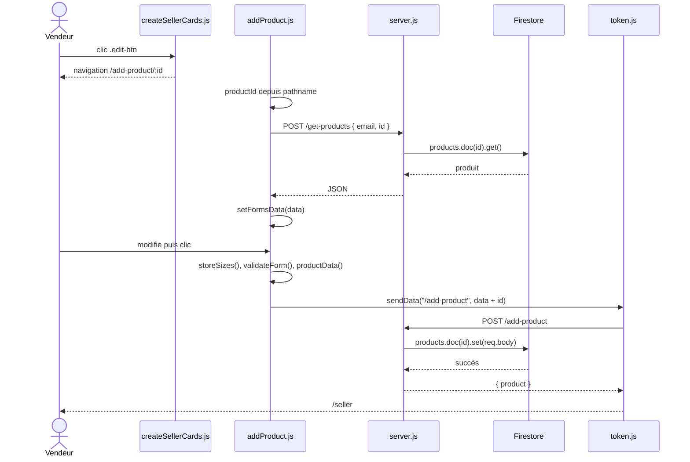

#### Tableau des fonctions

| Ordre | Fichier | Fonction / route | Entrée | Sortie / effet | Statut |
| ----: | ------- | ---------------- | ------ | -------------- | ------ |
| 1 | `createSellerCards.js` | `createSellerCards.js::createSellerCard()` | Produit | Crée lien `/add-product/:id` | 🟢 Navigation claire ; 🔴 ID dans action client |
| 2 | `addProduct.js` | `addProduct.js::fetchAddProductDataId()` | `productId`, `user.email` | POST lecture puis préremplissage | 🔴 Appelé avant contrôle `window.onload` |
| 3 | `server.js` | `server.js::POST /get-products` branche `id` | ID, e-mail ignoré | Renvoie le document | 🔴 Sans propriété ; 🔵 Product Medusa |
| 4 | `addProduct.js` | `addProduct.js::setFormsData()` | Produit | Remplit formulaire et globales | 🟢 Rôle UI clair ; 🟠 effets multiples |
| 5 | `addProduct.js` | `addProduct.js::storeSizes()` → `addProduct.js::validateForm()` → `addProduct.js::productData()` | Formulaire modifié | Payload avec même ID | 🟠 Chaîne globale |
| 6 | `server.js` | `server.js::POST /add-product` branche `id` | Produit + ID | `.set()` remplace le document | 🔴 Sans autorisation ; 🔵 Admin Medusa |

#### Données manipulées

`productId`, `email`, `id`, `name`, descriptions, `images`, `sizes`, prix, `stock`, `tags`, `draft` éventuel.

#### Stockages / services impliqués

- Firestore `products/{id}` ;
- S3 pour les nouvelles images ;
- `sessionStorage.user` et `tagsSeller`.

#### Dépendances transversales

- le lien d’édition est généré par `createSellerCards.js`, le formulaire par `addProduct.js`, le transport par `token.js` ;
- `addProduct.js::fetchAddProductDataId()` démarre pendant l’évaluation du script, avant le handler d’authentification au `load` ;
- `bing5.js` s’initialise ensuite avec les tags de session.

#### Problèmes identifiés

- 🔴 aucune vérification de propriété à la lecture ou à l’écriture ;
- 🔴 lorsque `id` existe, `server.js::POST /get-products` ignore complètement l’e-mail envoyé ;
- 🔴 un utilisateur non connecté peut provoquer un accès à `user.email` avant la redirection de `window.onload` ;
- 🔴 `.set(req.body)` remplace tout le document et toute personne connaissant l’ID peut l’appeler ;
- 🔴 images retirées/remplacées non supprimées de S3 ;
- 🟠 `tags.value = data.tags` repose sur la conversion implicite du tableau en chaîne ;
- 🔴 le bouton brouillon peut remplacer un produit publié sans transition contrôlée.

#### Cible Medusa

- **Remplacé par Medusa** 🔵 : récupération/mise à jour Product via Admin authentifié.
- **Marketplace** : route spécifique vérifiant vendeur authentifié et propriété à chaque opération.
- **Conservé** : formulaire seulement si une UI personnalisée est nécessaire.
- **À supprimer** : e-mail décoratif dans la requête et écriture arbitraire par ID.

#### Critères de validation de la migration

✅ À préserver :

- l’opérateur doit pouvoir ouvrir un produit existant avec ses données actuelles ;
- les champs, variantes, prix, stocks, tags et médias modifiés doivent être enregistrés sur le bon produit ;
- après sauvegarde, les outils de gestion et le storefront doivent refléter le nouvel état selon les règles de publication.

🎯 À obtenir dans la cible :

- seuls les opérateurs autorisés doivent pouvoir ouvrir et modifier le produit ;
- un utilisateur non autorisé ne doit ni lire ni modifier ce produit ;
- une modification ne doit pas supprimer silencieusement des données non éditées ;
- les changements de statut doivent être explicites ;
- une erreur doit laisser le produit dans un état cohérent et réessayable.

<a id="f-12"></a>

### F-12 — Suppression d’un produit

#### Objectif utilisateur

Supprimer un produit vendeur et les images S3 référencées par ce produit.

#### Déclencheur exact

Clic `.delete-popup-btn`, puis clic `.delete-btn` dans la confirmation.

#### Page de départ

`public/seller.html` après le chargement du catalogue F-08.

#### Scripts chargés

Ordre exact : `token.js` → `createSellerCards.js` → `seller.js`.

#### Chemin d’exécution

```text
createSellerCards.js::createSellerCard(data)
   ↓ génère onclick openDeletePopup(data.id)
clic .delete-popup-btn
   ↓
🟠 createSellerCards.js::openDeletePopup(id)
   ↓ affiche .delete-alert
   ↓ ajoute un listener à .close-btn
   ↓ ajoute un listener à .delete-btn capturant id
clic .delete-btn
   ↓
🔴 createSellerCards.js::deleteItem(id)
   ↓ fetch
POST /delete-product { id }
   ↓
🔴 server.js::POST /delete-product
   ↓
Firestore → products.doc(id).get()
   ↓ product.data().images
filtre les URL non nulles → extrait le dernier segment de chaque URL
   ↓ Promise.all()
S3 → deleteObject({ Bucket, Key }) pour chaque image
   ↓ si tous réussissent
Firestore → products.doc(id).delete()
   ↓ réponse "success" ou "err"
createSellerCards.js::deleteItem()
   ↓ si success
location.reload()
```

#### Diagramme Mermaid

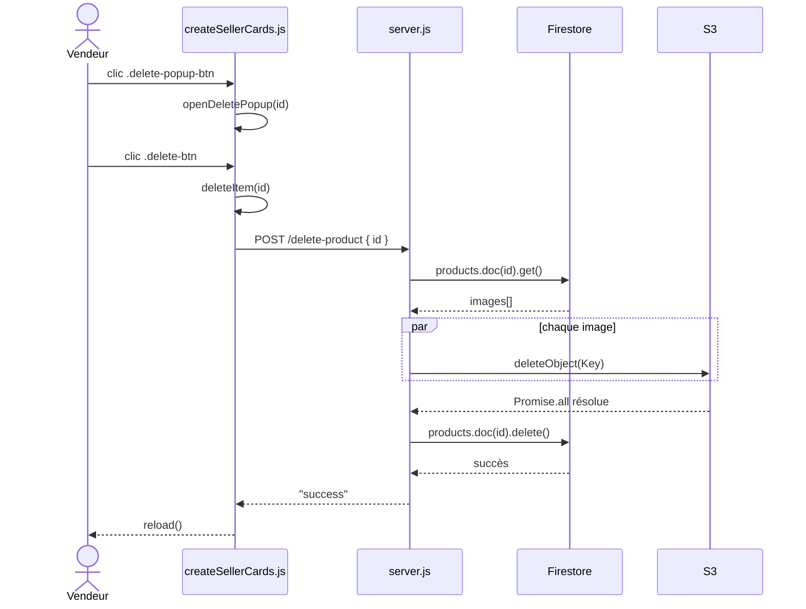

#### Tableau des fonctions

| Ordre | Fichier | Fonction / route | Entrée | Sortie / effet | Statut |
| ----: | ------- | ---------------- | ------ | -------------- | ------ |
| 1 | `createSellerCards.js` | `createSellerCards.js::openDeletePopup()` | ID produit | Ouvre confirmation et ajoute listeners | 🟠 Accumulation de listeners |
| 2 | `createSellerCards.js` | `createSellerCards.js::deleteItem()` | ID | POST puis recharge/alerte | 🔴 Aucune preuve de propriété |
| 3 | `server.js` | `server.js::POST /delete-product` | ID | Supprime images puis document | 🔴 Anonyme et gestion erreur incomplète ; 🔵 Product/File Medusa |
| 4 | AWS SDK | `s3.deleteObject()` | Bucket, clé | Supprime un objet | 🟢 Appel clair ; 🔵 File Module |

#### Données manipulées

`id`, `imageUrls`, `imageLinks`, `idImages`, `bucketParams`, `Bucket`, `Key`.

#### Stockages / services impliqués

- Firestore `products/{id}` ;
- Amazon S3 ;
- DOM de confirmation.

#### Dépendances transversales

- F-08 crée les boutons et transmet l’ID à `createSellerCards.js::openDeletePopup()` ;
- `createSellerCards.js::deleteItem()` utilise `token.js::showAlert()` sur erreur ;
- le serveur suppose que les URL Firestore permettent de retrouver la clé S3 avec `url.split("/").pop()`.

#### Problèmes identifiés

- 🔴 aucune authentification ni vérification de propriété ;
- 🔴 chaque ouverture ajoute de nouveaux listeners : confirmer B peut aussi rappeler une suppression préparée pour A ;
- 🔴 produit absent ou `images` inattendu provoque une exception avant réponse ;
- 🔴 si un `deleteObject` échoue, le `catch` journalise seulement l’erreur et ne répond pas au client ;
- 🟠 suppression définitive sans corbeille, désactivation ni restauration ;
- 🟠 globales `docRef`, `imageLinks` et `idImages` assignées sans déclaration dans la route active.

#### Cible Medusa

- **Remplacé par Medusa** 🔵 : suppression/dépublication Product et suppression média via File Module.
- **Conservé** : confirmation UI, avec listener unique et état explicite.
- **Suggestion** : préférer dépublication/archivage lorsque l’historique commande doit conserver la référence.
- **Marketplace** : autorisation de propriété obligatoire côté serveur.

#### Critères de validation de la migration

✅ À préserver :

- une confirmation doit identifier sans ambiguïté le produit concerné ;
- le produit ne doit plus être achetable ni apparaître dans le storefront après l’opération prévue.

🎯 À obtenir dans la cible :

- seul un opérateur autorisé doit pouvoir retirer, archiver ou supprimer un produit ;
- confirmer une action ne doit jamais rejouer une ancienne suppression ;
- l’historique des commandes existantes doit rester exploitable ;
- les médias devenus inutiles doivent être traités selon une règle explicite et vérifiable ;
- un échec partiel doit être signalé et ne doit pas laisser silencieusement des données incohérentes.

<a id="f-13"></a>

### F-13 — Gestion des tags vendeur et produit

#### Objectif utilisateur

Réutiliser, ajouter, retirer ou sélectionner des mots-clés vendeur lors de la création/modification d’un produit.

#### Déclencheur exact

Chargement de `public/addProduct.html`, clic `#newElement`, clic sur un tag, clic sur son `x`, filtre alphabétique, puis publication ou déconnexion.

#### Page de départ

`public/addProduct.html`.

#### Scripts chargés

Ordre exact : `token.js` → `addProduct.js` → `bing5.js`. `bing5.js` s’exécute immédiatement après `addProduct.js`.

#### Chemin d’exécution

```text
public/addProduct.html
   ↓
bing5.js (exécution globale)
   ↓ parse sessionStorage.user puis lit .tagsSeller dans TagsSeller
🟠 bing5.js::updateTagList()
   ↓ reconstruit #tagList avec createElement/textContent
clic #newElement
   ↓ ajoute inputTag.value au tableau mémoire TagsSeller
   ↓ bing5.js::updateTagList()
clic sur un tag
   ↓ ajoute "tag, " au textarea #selected
clic sur x
   ↓ retire le tag du tableau mémoire TagsSeller
filtre #alphabetList
   ↓ modifie filterLetter et rappelle bing5.js::updateTagList()
   ↓ aucun de ces changements mémoire n’écrit sessionStorage
clic publier ou brouillon
   ↓
🟠 addProduct.js::productData()
   ↓ parse à nouveau sessionStorage.user
   ↓ lit l’ancien userObject.tagsSeller
   ↓ découpe #selected en tagArr
   ↓ fusionne ancien tagsSeller + tagArr et déduplique
sessionStorage["user"].tagsSeller = uniqueArr
   ↓
Firestore → products.tags via POST /add-product
   ↓ plus tard, uniquement à la déconnexion F-03
POST /savecart { tagsSeller }
   ↓
Firestore → sellers.doc(email).set({ tagsSeller }, { merge: true })
```

#### Diagramme Mermaid

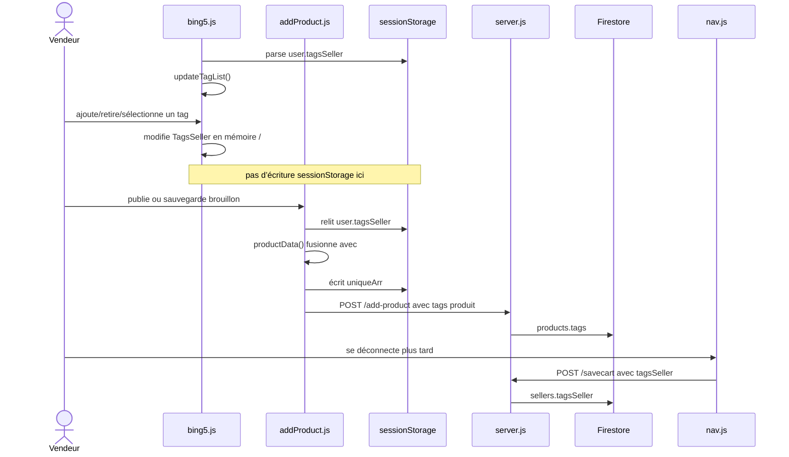

#### Tableau des fonctions

| Ordre | Fichier | Fonction / route | Entrée | Sortie / effet | Statut |
| ----: | ------- | ---------------- | ------ | -------------- | ------ |
| 1 | `bing5.js` | Initialisation globale | `sessionStorage.user.tagsSeller` | Définit `TagsSeller` | 🔴 Peut échouer avant contrôle d’accès |
| 2 | `bing5.js` | `bing5.js::updateTagList()` | `TagsSeller`, `filterLetter` | Reconstruit liste et handlers | 🟢 `textContent` sûr ; 🟠 recrée les listeners |
| 3 | `bing5.js` | Gestionnaires tags anonymes | Clics et saisie | Modifient mémoire et `#selected` | 🟠 Pas de persistance directe |
| 4 | `addProduct.js` | `addProduct.js::productData()` | `#selected`, session | Fusionne et écrit `tagsSeller` local | 🟠 Effets multiples / état potentiellement obsolète |
| 5 | `server.js` | `server.js::POST /add-product` | `tags` produit | Écrit `products.tags` | 🔵 Product/Taxonomie Medusa |
| 6 | `server.js` | `server.js::POST /savecart` | `tagsSeller` | Fusionne dans `sellers` au logout | 🔴 Couplage au logout ; spécifique marketplace |

#### Données manipulées

`TagsSeller`, `tagsSeller`, `tag`, `tagArr`, `mergedArr`, `uniqueArr`, `filterLetter`, `inputTag`, `selected`, `email`.

#### Stockages / services impliqués

- `sessionStorage.user.tagsSeller` ;
- Firestore `products.tags` et `sellers.tagsSeller` ;
- DOM `#tagList`, `#selected`, `#alphabetList`.

#### Dépendances transversales

- `bing5.js` et `addProduct.js` analysent séparément `sessionStorage.user`, donc ne partagent pas le même objet mémoire ;
- la sélection visible passe par le champ `#selected` consommé par `addProduct.js::productData()` ;
- la persistance vendeur dépend de F-03 ;
- la route `POST /tagsSeller` est commentée et **inactive**.

#### Problèmes identifiés

- 🔴 utilisateur absent ou `tagsSeller: null` peut faire échouer `bing5.js` avant le contrôle `window.onload` ;
- 🟠 ajout/retrait dans `TagsSeller` n’est pas immédiatement écrit dans `sessionStorage` ; seuls les tags présents dans `#selected` sont fusionnés par `addProduct.js::productData()` ;
- 🟠 retirer un tag de la liste mémoire ne le retire pas nécessairement de l’ancien tableau relu depuis la session ;
- 🟠 règles affichées dans l’alerte (tiret/pluriel) non réellement validées ;
- 🔴 la recherche F-15 exige une égalité exacte `array-contains`, sans taxonomie ni synonymes ;
- 🔴 persistance vendeur seulement au logout.

#### Cible Medusa

- **Remplacé par Medusa** 🔵 : tags/catégories/collections et association produit selon la taxonomie retenue.
- **Développé spécifiquement** : vocabulaire vendeur si marketplace.
- **Conservé** : interaction de sélection seulement si utile, avec source serveur et sauvegarde explicite.
- **À supprimer** : persistance des tags vendeur couplée à `/savecart` et à la déconnexion.

#### Critères de validation de la migration

✅ À préserver :

- les valeurs proposées et sélectionnées doivent être visibles avant sauvegarde ;
- l’opérateur doit pouvoir ajouter ou retirer les valeurs associées au produit.

🎯 À obtenir dans la cible :

- un opérateur autorisé doit pouvoir associer au produit les catégories, collections ou tags retenus par la taxonomie cible ;
- les ajouts et retraits doivent être persistés explicitement avec le produit ;
- la recherche et les listes doivent utiliser les valeurs sauvegardées selon des règles documentées ;
- les doublons et valeurs invalides doivent être traités de façon prévisible ;
- ⚪ si un vocabulaire propre au vendeur est conservé, il doit être isolé par vendeur et sauvegardé sans dépendre de la déconnexion.

<a id="f-14"></a>

### F-14 — Chargement de l’accueil

#### Objectif utilisateur

Voir les sélections de produits homme et femme dès l’ouverture du site.

#### Déclencheur exact

Ouverture de `/` ou `public/index.html`.

#### Page de départ

`public/index.html`.

#### Scripts chargés

Ordre exact : `nav.js` → `footer.js` → `homesliders.js` → script inline de `index.html`.

#### Chemin d’exécution

```text
public/index.html
   ↓
🟢 nav.js::createNav()
   ↓ injecte la navigation
🟢 footer.js::createFooter()
   ↓ injecte le pied de page
homesliders.js définit ses fonctions globales
   ↓ script inline
🟢 homesliders.js::getProducts("men")
🟢 homesliders.js::getProducts("women")
   ↓ deux fetch POST /get-products { tag }
🔵 server.js::POST /get-products
   ↓ branche tag
Firestore → products.where("tags", "array-contains", tag).get()
   ↓ ajoute item.id puis renvoie les tableaux
🟢 homesliders.js::createProductSlider(data, parent, title)
   ↓
🟠 homesliders.js::createCard(data)
   ↓ HTML des cartes avec onclick /products/:id
🟠 homesliders.js::setupSlidingEffect()
   ↓ mesure les conteneurs et installe les flèches
```

#### Diagramme Mermaid

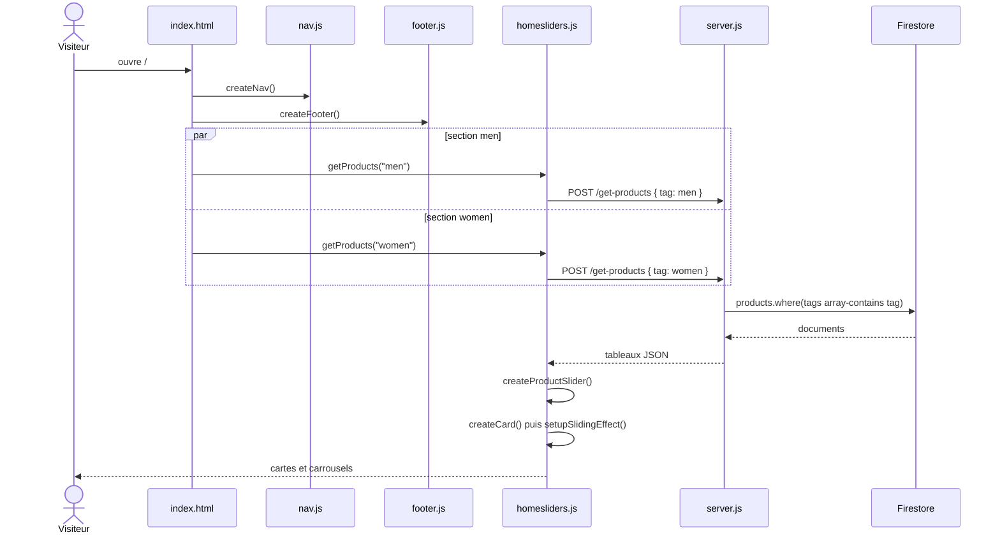

#### Tableau des fonctions

| Ordre | Fichier | Fonction / route | Entrée | Sortie / effet | Statut |
| ----: | ------- | ---------------- | ------ | -------------- | ------ |
| 1 | `nav.js` | `nav.js::createNav()` | `.navbar` | Navigation | 🟢 UI conservable ; 🟠 liens production codés en dur |
| 2 | `footer.js` | `footer.js::createFooter()` | `footer` | Pied de page | 🟢 UI ; 🟠 contenu statique de démonstration |
| 3 | `homesliders.js` | `homesliders.js::getProducts()` | Tag | POST et tableau | 🟢 Clair ; 🔵 Store API Medusa |
| 4 | `server.js` | `server.js::POST /get-products` branche `tag` | Tag | Requête Firestore | 🔴 Inclut brouillons ; 🔵 catalogue Medusa |
| 5 | `homesliders.js` | `homesliders.js::createProductSlider()` | Données, parent, titre | Ajoute une section | 🟢 Rôle UI ; 🟠 `innerHTML +=` |
| 6 | `homesliders.js` | `homesliders.js::createCard()` | Tableau | HTML cartes | 🔴 Champs non échappés |
| 7 | `homesliders.js` | `homesliders.js::setupSlidingEffect()` | DOM des carrousels | Ajoute listeners flèches | 🟠 Réinstalle sur tous les carrousels |

#### Données manipulées

Tags `men`, `women`, tableaux produit, `id`, `discount`, `images`, `name`, `shortDes`, `sellPrice`, `actualPrice`.

#### Stockages / services impliqués

- Firestore `products` ;
- DOM des deux sections accueil ;
- aucun stockage navigateur pour le catalogue.

#### Dépendances transversales

- le script inline de `index.html` dépend de `homesliders.js` chargé juste avant ;
- les cartes générées raccordent F-04/F-16 via `/products/:id` ;
- `homesliders.js::createProductSlider()` appelle `homesliders.js::createCard()` puis `homesliders.js::setupSlidingEffect()`.

#### Problèmes identifiés

- 🔴 aucun filtre `draft` ;
- 🔴 données produit injectées dans le HTML, risque XSS persistante ;
- 🔴 si le serveur répond `"no products"`, `homesliders.js::createCard()` traite la chaîne comme un tableau et accède à des propriétés inexistantes ;
- 🟠 chaque nouvel appel à `homesliders.js::setupSlidingEffect()` réinstalle des listeners sur les carrousels déjà présents ;
- 🟠 les catégories de navigation pointent vers un domaine de production codé en dur ;
- 🟠 les tuiles collection statiques ont `href="#"` et ne déclenchent pas de parcours catalogue.

#### Cible Medusa

- **Conservé dans le storefront** : hero, sections, cartes et carrousel après sécurisation.
- **Remplacé par Medusa** 🔵 : récupération des produits publiés, prix et images via Store API.
- **Suggestion** : rendre catégories/collections configurables et initialiser chaque carrousel une seule fois.
- **À supprimer** : requête Firestore directe via l’endpoint générique.

#### Critères de validation de la migration

✅ À préserver :

- l’accueil doit charger sans erreur et afficher les sections commerciales retenues ;
- chaque carte doit afficher des informations cohérentes et ouvrir la bonne fiche produit ;
- les carrousels présents doivent rester utilisables au clavier, au pointeur et sur les formats responsives retenus ;

🎯 À obtenir dans la cible :

- seules des données publiables et disponibles dans le canal concerné doivent être présentées ;
- un état vide ou une erreur de chargement ne doit pas casser le reste de la page ;
- aucun événement ne doit être dupliqué lors de l’ajout de plusieurs sections.

<a id="f-15"></a>

### F-15 — Recherche produit

#### Objectif utilisateur

Saisir un terme dans la navigation et afficher les produits dont un tag correspond exactement.

#### Déclencheur exact

Clic `.search-btn` ou touche Entrée dans `.search-box`.

#### Page de départ

Toute page chargeant `nav.js`, puis `public/search.html` servi par `/search/:key`.

#### Scripts chargés

Sur la page résultat : `nav.js` → `footer.js` → `homesliders.js` → `search.js`.

#### Chemin d’exécution

```text
nav.js::createNav()
   ↓ crée .search-box et .search-btn
saisie utilisateur
   ├── keypress Enter → déclenche click .search-btn
   └── clic direct .search-btn
       ↓ gestionnaire anonyme nav.js
searchValue = searchBox.value.toLowerCase()
   ↓
location.href = "/search/" + searchValue
   ↓
GET /search/:key
   ↓ server.js sert public/search.html
search.js (exécution globale)
   ↓ extrait et decodeURI le dernier segment dans searchKey
   ↓ injecte searchKey dans #search-key.innerHTML
🟠 homesliders.js::getProducts(searchKey)
   ↓ POST /get-products { tag: searchKey }
🔵 server.js::POST /get-products
   ↓
Firestore → products.where("tags", "array-contains", tag).get()
   ↓ réponse
🟠 homesliders.js::createCard(data, ".card-container")
   ↓ affiche les résultats
clic carte → /products/:id → F-04/F-16
```

#### Diagramme Mermaid

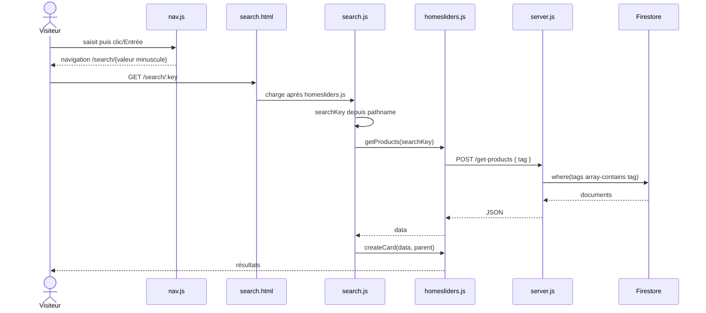

#### Tableau des fonctions

| Ordre | Fichier | Fonction / route | Entrée | Sortie / effet | Statut |
| ----: | ------- | ---------------- | ------ | -------------- | ------ |
| 1 | `nav.js` | Gestionnaires recherche anonymes | Texte/clic/Entrée | Navigation `/search/:key` | 🟢 UX simple ; 🟠 URL non construite avec encodeURIComponent |
| 2 | `server.js` | `server.js::GET /search/:key` | Paramètre route | Sert `search.html` | 🟢 Route page |
| 3 | `search.js` | Initialisation globale | `location.pathname` | Affiche terme et lance la requête | 🔴 Terme injecté par `innerHTML` |
| 4 | `homesliders.js` | `homesliders.js::getProducts()` | Tag | POST `/get-products` | 🟢 ; 🔵 API Store/recherche cible |
| 5 | `server.js` | `server.js::POST /get-products` branche `tag` | Tag exact | Tableau Firestore | 🟠 Recherche limitée ; 🔵 Medusa |
| 6 | `homesliders.js` | `homesliders.js::createCard()` | Résultats | HTML cartes | 🔴 Injection possible |

#### Données manipulées

`searchBox.value`, `searchValue`, `searchKey`, `tag`, tableau de produits et champs de carte.

#### Stockages / services impliqués

- URL du navigateur ;
- Firestore `products.tags` ;
- DOM de la page résultat.

#### Dépendances transversales

- `search.js` ne définit aucune fonction ; il appelle immédiatement deux globales de `homesliders.js` ;
- les champs et événements de recherche sont créés dynamiquement par `nav.js::createNav()` avant leur sélection ;
- les cartes raccordent la fiche produit F-04 et les similaires F-16.

#### Problèmes identifiés

- 🔴 recherche uniquement par tag exact `array-contains`; pas de nom, marque, description, tolérance ou synonymes ;
- 🔴 `searchKey` est écrit avec `innerHTML` ;
- 🟠 valeur placée dans le chemin sans `encodeURIComponent` ; caractères `/`, `?` ou `#` peuvent changer l’URL ;
- 🔴 absence de résultat non gérée comme une liste vide ;
- 🔴 brouillons non filtrés ;
- 🔴 cartes construites avec HTML non échappé.

#### Cible Medusa

- **Conservé dans le storefront** : champ, validation Entrée/clic et grille de résultats.
- **Remplacé par Medusa** 🔵 : source catalogue et filtres Store API.
- **Développé spécifiquement** : moteur de recherche plein texte si le besoin dépasse les filtres du catalogue retenu.
- **Suggestion** : route de recherche avec paramètre encodé, état vide et rendu sûr.

#### Critères de validation de la migration

✅ À préserver :

- l’utilisateur doit pouvoir lancer une recherche par clic et par touche Entrée ;
- cliquer un résultat doit ouvrir la bonne fiche ;

🎯 À obtenir dans la cible :

- le terme recherché doit être transmis et affiché sans casser l’URL ni permettre d’injection ;
- les résultats doivent contenir uniquement des produits publiables du périmètre commercial ;
- l’absence de résultat et une erreur de service doivent produire des états distincts et compréhensibles ;
- les champs de recherche retenus — tags seuls ou recherche enrichie — doivent correspondre à la décision métier documentée.

<a id="f-16"></a>

### F-16 — Chargement des produits similaires

#### Objectif utilisateur

Voir, sous une fiche produit, un carrousel de produits partageant chacun de ses tags.

#### Déclencheur exact

Réception réussie du produit dans `product.js::getProductDataId()`.

#### Page de départ

`public/product.html`.

#### Scripts chargés

Ordre exact : `nav.js` → `footer.js` → `homesliders.js` → `product.js`.

#### Chemin d’exécution

```text
product.js::getProductDataId()
   ↓ reçoit data depuis POST /get-products { id }
product.js::setData(data)
   ↓ tagsArray = data.tags  (assignation globale implicite)
   ↓ forEach(tag)
🟠 homesliders.js::getProducts(tag)
   ↓ POST /get-products { tag }
server.js::POST /get-products
   ↓ Firestore products.where("tags", "array-contains", tag)
   ↓ tableau avec id
🟠 homesliders.js::createProductSlider(data, ".container-for-card-slider", titre)
   ↓
homesliders.js::createCard(data)
   ↓ exclut la carte dont id == dernier segment de l’URL
homesliders.js::setupSlidingEffect()
   ↓ répété une fois par tag
```

#### Diagramme Mermaid

```mermaid
sequenceDiagram
    actor Client
    participant P as product.js
    participant H as homesliders.js
    participant E as server.js
    participant DB as Firestore

    P->>P: getProductDataId() reçoit data
    P->>P: setData(data); tagsArray=data.tags
    loop chaque tag
        P->>H: getProducts(tag)
        H->>E: POST /get-products { tag }
        E->>DB: where(tags array-contains tag)
        DB-->>E: produits
        E-->>H: tableau avec id
        H-->>P: data
        P->>H: createProductSlider(data, parent, titre)
        H->>H: createCard() puis setupSlidingEffect()
    end
    H-->>Client: carrousels similaires
```

#### Tableau des fonctions

| Ordre | Fichier | Fonction / route | Entrée | Sortie / effet | Statut |
| ----: | ------- | ---------------- | ------ | -------------- | ------ |
| 1 | `product.js` | `product.js::getProductDataId()` | Produit chargé | Parcourt `data.tags` | 🟠 Mélange fiche et recommandations |
| 2 | `homesliders.js` | `homesliders.js::getProducts()` | Un tag | Tableau de produits | 🟢 Réutilisé ; 🔵 catalogue Medusa |
| 3 | `server.js` | `server.js::POST /get-products` branche `tag` | Tag | Requête Firestore | 🔴 Pas de filtre publication |
| 4 | `homesliders.js` | `homesliders.js::createProductSlider()` | Tableau/parent/titre | Ajoute un carrousel | 🟢 UI ; 🟠 duplication possible |
| 5 | `homesliders.js` | `homesliders.js::createCard()` | Tableau | Exclut l’ID courant et rend les cartes | 🟠 Dépend de `location.pathname`; 🔴 HTML non sûr |
| 6 | `homesliders.js` | `homesliders.js::setupSlidingEffect()` | Tous les carrousels DOM | Réinstalle listeners | 🟠 Accumulation |

#### Données manipulées

`data.tags`, `tagsArray`, `tag`, identifiant courant, tableaux de produits similaires.

#### Stockages / services impliqués

- Firestore `products` ;
- URL courante ;
- DOM `.container-for-card-slider`.

#### Dépendances transversales

- `product.js` dépend de trois fonctions globales de `homesliders.js` ;
- `homesliders.js::createCard()` dépend implicitement de l’URL pour exclure le produit courant ;
- les mêmes fonctions servent également F-14 et F-15.

#### Problèmes identifiés

- 🟠 une requête réseau et un carrousel sont créés pour chaque tag ;
- 🟠 un produit partageant plusieurs tags peut apparaître dans plusieurs carrousels ;
- 🟠 `tagsArray` est assignée sans déclaration ;
- 🟠 `homesliders.js::setupSlidingEffect()` réattache des événements à tous les carrousels à chaque ajout ;
- 🔴 brouillons possibles et HTML non échappé ;
- 🔴 aucune gestion explicite si `data.tags` est absent ou non tableau.

#### Cible Medusa

- **Conservé dans le storefront** : emplacement et cartes de recommandation.
- **Remplacé par Medusa** 🔵 : source produits et statut de publication.
- **Développé spécifiquement** : logique de recommandation ou requête agrégée, car le simple N-appels par tags est une règle actuelle, pas une cible décidée.
- **Suggestion** : séparer `loadRelatedProducts()` de `getProductDataId()` et dédupliquer les résultats.

#### Critères de validation de la migration

⚪ Critères applicables uniquement si les produits similaires sont conservés.

✅ À préserver :

- la fiche doit pouvoir afficher une sélection de produits associés selon la règle retenue ;
- chaque recommandation doit ouvrir la bonne fiche.

🎯 À obtenir dans la cible :

- le produit courant ne doit pas être recommandé à lui-même ;
- un même produit ne doit pas être répété inutilement ;
- seuls des produits publiables et disponibles dans le bon canal doivent apparaître ;
- l’absence de recommandation ou une erreur ne doit pas empêcher l’affichage de la fiche principale.

<a id="f-17"></a>

### F-17 — Ajout et affichage de la wishlist

#### Objectif utilisateur

Ajouter un produit choisi à une wishlist locale et le revoir dans la page panier.

#### Déclencheur exact

Clic `.wishlist-btn` après sélection d’une `.size-radio-btn`, puis ouverture de `/cart`.

#### Page de départ

`public/product.html`, puis `public/cart.html`.

#### Scripts chargés

Produit : `nav.js` → `footer.js` → `homesliders.js` → `product.js`. Panier : `nav.js` → `footer.js` → `homesliders.js` → `cart.js`.

#### Chemin d’exécution

```text
product.js::setData(data)
   ↓ installe le listener .wishlist-btn
clic .size-radio-btn
   ↓ product.js met size et hasCheckedSize
clic .wishlist-btn
   ↓ si taille choisie
🔴 homesliders.js::add_product_to_cart_or_wishlist("wishlist", data)
   ↓ lit globale size
   ↓ ajoute la copie du produit
localStorage["wishlist"]
   ↓ ouverture /cart
cart.js::setProducts("cart")
   ↓ calcule totalBill panier
cart.js::setProducts("wishlist")
   ↓
cart.js::createSmallCards()
   ↓ cart.js::updateBill() est rappelé même pour wishlist
cart.js::setupEvents("wishlist")
   ↓ ajoute quantité et suppression à la wishlist
```

#### Diagramme Mermaid

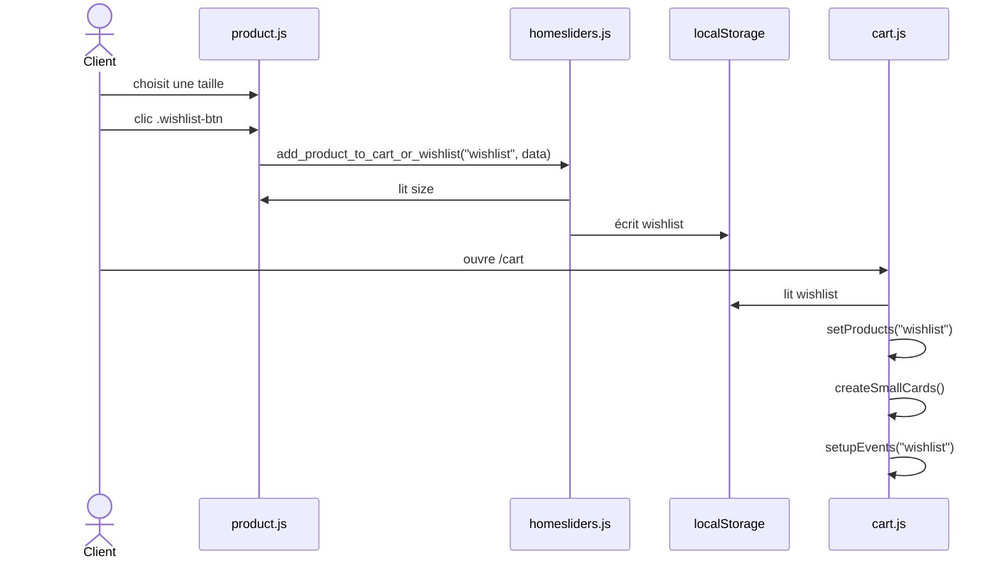

#### Tableau des fonctions

| Ordre | Fichier | Fonction / route | Entrée | Sortie / effet | Statut |
| ----: | ------- | ---------------- | ------ | -------------- | ------ |
| 1 | `product.js` | Listener `.wishlist-btn` installé par `product.js::setData()` | Produit + taille | Appelle fonction générique | 🟠 Dépendance globale |
| 2 | `homesliders.js` | `homesliders.js::add_product_to_cart_or_wishlist()` | `"wishlist"`, produit, `size` | Ajoute dans stockage local | 🔴 Aucun ID ; wishlist spécifique à décider |
| 3 | `cart.js` | `cart.js::setProducts("wishlist")` | Wishlist locale | Rend les lignes | 🟢 UI réutilisable ; 🟠 logique panier réemployée |
| 4 | `cart.js` | `cart.js::setupEvents("wishlist")` | DOM/liste | Quantité et suppression | 🟠 Quantité inhabituelle pour une wishlist |

#### Données manipulées

`wishlist`, `size`, `item`, `name`, `sellPrice`, `shortDes`, `image`, `totalBill`.

#### Stockages / services impliqués

- `localStorage.wishlist` ;
- Firestore `saved.wishlist` seulement à la déconnexion F-03.

#### Dépendances transversales

- même dépendance circulaire `product.js` ↔ `homesliders.js` que F-04 ;
- partage `cart.js::createSmallCards()`, `cart.js::setProducts()` et `cart.js::setupEvents()` avec le panier ;
- aucune fonction ne transfère une ligne wishlist vers le panier.

#### Problèmes identifiés

- 🔴 absence d’identifiant produit/variante et prix modifiable ;
- 🟠 sélection d’une taille obligatoire même pour la wishlist ;
- 🟠 lignes identiques non fusionnées ;
- 🟠 les boutons +/− modifient une quantité de wishlist et la globale `totalBill`, sans mettre le total affiché à jour pour ce type ;
- 🔴 persistance Firestore seulement au logout ;
- 🟠 aucun parcours wishlist → panier.

#### Cible Medusa

- **Décision** : la wishlist doit être explicitement conservée ou supprimée.
- **Développé spécifiquement** : wishlist persistante liée au Customer si retenue.
- **Remplacé par Medusa** 🔵 : référence produit/variante et données catalogue.
- **Conservé** : présentation UI après séparation nette de la logique panier.

#### Critères de validation de la migration

⚪ Critères applicables uniquement si la wishlist est conservée.

✅ À préserver :

- l’utilisateur doit pouvoir ajouter un produit ou une variante à sa wishlist ;
- l’élément ajouté doit apparaître dans une vue dédiée ou clairement identifiée ;
- l’utilisateur doit pouvoir retirer un élément ;

🎯 À obtenir dans la cible :

- la wishlist doit conserver des références catalogue valides, sans recopier un prix faisant autorité ;
- la persistance invitée ou client doit suivre une règle explicite ;
- si le transfert wishlist → panier est retenu, il doit demander ou conserver une variante valide et contrôler sa disponibilité.

<a id="f-18"></a>

### F-18 — Modifier les quantités ou supprimer une ligne panier

#### Objectif utilisateur

Ajuster une quantité entre 1 et 9 ou retirer une ligne du panier local.

#### Déclencheur exact

Clic `.decrement`, `.increment` ou `.sm-delete-btn` dans `/cart`.

#### Page de départ

`public/cart.html`.

#### Scripts chargés

Ordre exact : `nav.js` → `footer.js` → `homesliders.js` → `cart.js`.

#### Chemin d’exécution

```text
cart.js (exécution globale)
   ↓
cart.js::setProducts("cart")
   ↓ lit localStorage.cart
   ↓ cart.js::createSmallCards() + cart.js::updateBill()
🟠 cart.js::setupEvents("cart")
   ↓ capture product = JSON.parse(localStorage.cart)
clic .decrement
   ↓ si item.innerHTML > 1
diminue compteur, totalBill et prix de ligne
   ↓ product[i].item = item.innerHTML
localStorage["cart"] = product
   ↓ cart.js::updateBill()

clic .increment
   ↓ si item.innerHTML < 9
augmente compteur, totalBill et prix de ligne
   ↓ écrit localStorage puis cart.js::updateBill()

clic .sm-delete-btn
   ↓ filtre le tableau par index
localStorage["cart"] = tableau filtré
   ↓ location.reload()
   ↓ setProducts("cart") recalcule depuis zéro
```

#### Diagramme Mermaid

```mermaid
sequenceDiagram
    actor Client
    participant C as cart.js
    participant L as localStorage
    participant D as DOM panier

    C->>L: lit cart
    C->>C: setProducts("cart")
    C->>C: setupEvents("cart")
    alt clic + ou - dans limites
        Client->>C: clic compteur
        C->>D: met à jour quantité/prix/total
        C->>L: réécrit cart
        C->>C: updateBill()
    else clic supprimer
        Client->>C: clic .sm-delete-btn
        C->>L: écrit tableau filtré
        C-->>Client: location.reload()
    end
```

#### Tableau des fonctions

| Ordre | Fichier | Fonction / route | Entrée | Sortie / effet | Statut |
| ----: | ------- | ---------------- | ------ | -------------- | ------ |
| 1 | `cart.js` | `cart.js::setProducts("cart")` | Tableau local | Rend et calcule total | 🟢 UI ; 🔴 dépend de clé existante |
| 2 | `cart.js` | `cart.js::setupEvents("cart")` | Lignes DOM + tableau | Installe trois types de clic | 🟠 Responsabilités multiples ; 🔵 Cart Medusa |
| 3 | `cart.js` | Gestionnaires `.decrement` / `.increment` | Index, coût | Modifient DOM, globale et stockage | 🔴 Aucun stock serveur |
| 4 | `cart.js` | Gestionnaire `.sm-delete-btn` | Index | Filtre et recharge la page | 🟠 Rechargement complet ; 🔵 suppression ligne Medusa |
| 5 | `cart.js` | `cart.js::updateBill()` | `totalBill` | Met à jour `.bill` | 🟢 UI ; 🔵 total serveur Medusa |

#### Données manipulées

`product`, `i`, `item`, `cost`, `item.innerHTML`, `sellPrice`, `totalBill`, `cart`.

#### Stockages / services impliqués

- `localStorage.cart` uniquement ;
- aucun appel Express, Firestore ou contrôle stock lors de ces mutations.

#### Dépendances transversales

- dépend du HTML produit par `cart.js::createSmallCards()` ;
- partage la globale `totalBill` avec le rendu initial et la wishlist ;
- F-05/F-06 consomment ensuite les quantités et prix ainsi modifiés sans relecture serveur.

#### Problèmes identifiés

- 🔴 aucune vérification du stock, du prix ou de l’existence du produit ;
- 🔴 quantité stockée depuis `innerHTML` sous forme de chaîne ;
- 🟠 limites 1 et 9 codées en dur ;
- 🟠 suppression identifie la ligne par index, pas par produit/variante ;
- 🔴 le total est calculé uniquement depuis les copies locales modifiables ;
- 🟠 suppression recharge toute la page ;
- 🔴 une clé `cart` absente fait échouer le rendu avant l’installation des événements.

#### Cible Medusa

- **Conservé dans le storefront** : contrôles quantité, suppression et total visuel.
- **Remplacé par Medusa** 🔵 : update/delete des line items, validation quantité/stock et totaux calculés serveur.
- **À supprimer** : identification par index et prix calculé depuis `localStorage`.
- **Suggestion** : mise à jour optimiste seulement avec reprise sur la réponse Medusa.

#### Critères de validation de la migration

✅ À préserver :

- l’utilisateur doit pouvoir augmenter ou diminuer une quantité dans les limites autorisées ;
- l’utilisateur doit pouvoir supprimer précisément la ligne choisie ;
- les changements doivent rester visibles après rechargement selon la politique de persistance du panier.

🎯 À obtenir dans la cible :

- les quantités doivent respecter la disponibilité et les règles de vente du système cible ;
- prix de ligne, réductions et total doivent être recalculés par le système commerce puis reflétés dans l’interface ;
- une mutation refusée doit restaurer un état cohérent et expliquer l’échec ;
- l’identité d’une ligne doit reposer sur le panier et la variante, pas sur sa position visuelle ;

<a id="f-19"></a>

### F-19 — Retirer ou remplacer une image produit

#### Objectif utilisateur

Retirer une image d’un formulaire produit ou la remplacer par un nouveau fichier avant d’enregistrer le produit.

#### Déclencheur exact

Clic sur un bouton `.delete-image` pour retirer le slot, ou sélection d’un nouveau fichier dans l’input `.fileupload` correspondant pour le remplacer.

#### Page de départ

`public/addProduct.html`, en création `/add-product` ou en modification `/add-product/:id`.

#### Scripts chargés

Ordre exact : `token.js` → `addProduct.js` → `bing5.js`. Les quatre listeners de sélection de fichier et les quatre listeners de retrait sont installés pendant l’évaluation globale de `addProduct.js`.

#### Chemin d’exécution

```text
public/addProduct.html
   ↓ définit 4 inputs .fileupload et 4 boutons .delete-image
addProduct.js (initialisation globale)
   ↓ uploadImages = document.querySelectorAll(".fileupload")
   ↓ deleteButtons = document.querySelectorAll(".delete-image")
   ↓ imagePaths = [null, null, null, null]
   ↓ installe les listeners par forEach(index)

CAS 1 — Retirer une image du formulaire
clic .delete-image au slot index
   ↓ gestionnaire anonyme addProduct.js
imagePaths[index] = null
   ↓ retrouve le label grâce à deleteButton.parentNode.htmlFor
label.style.backgroundImage = null
   ↓ filtre les valeurs restantes dans la globale implicite imageLinks
.product-image.style.backgroundImage = url(dernière image restante)
   ↓
🟢 addProduct.js::updateDeleteButtonVisibility()
   ↓ masque le bouton du slot vide
   ↓ aucun fetch, aucun appel Express, aucun s3.deleteObject()
🔴 objet S3 inchangé
   ↓ si l’utilisateur enregistre ensuite le produit
F-09 ou F-11 écrit le nouveau tableau imagePaths dans Firestore
   ↓ l’ancienne URL disparaît du document, mais pas le fichier S3

CAS 2 — Remplacer une image
sélection d’un fichier dans le même input .fileupload
   ↓ gestionnaire change de addProduct.js
vérifie file.type.includes("image")
   ↓ GET /s3url
server.js::GET /s3url
   ↓ server.js::generateUrl()
   ↓ nouvelle URL putObject signée
PUT direct du nouveau fichier vers S3
   ↓ si la promesse PUT se résout
imagePaths[index] = nouvelle URL sans query string
   ↓ remplace l’aperçu du label et de .product-image
addProduct.js::updateDeleteButtonVisibility()
   ↓ ancien objet S3 non supprimé
   ↓ enregistrement ultérieur via F-09 ou F-11
Firestore reçoit la nouvelle URL du slot
```

#### Diagramme Mermaid

```mermaid
sequenceDiagram
    actor Vendeur
    participant A as addProduct.js
    participant E as server.js
    participant S as S3
    participant DB as Firestore

    alt retirer le slot
        Vendeur->>A: clic .delete-image[index]
        A->>A: imagePaths[index] = null
        A->>A: met à jour les aperçus
        A->>A: updateDeleteButtonVisibility()
        Note over A,S: aucun appel de suppression S3
    else remplacer le slot
        Vendeur->>A: change .fileupload[index]
        A->>E: GET /s3url
        E->>E: generateUrl()
        E-->>A: nouvelle URL signée
        A->>S: PUT nouveau fichier
        S-->>A: réponse PUT
        A->>A: imagePaths[index] = nouvelle URL
        A->>A: met à jour les aperçus et boutons
        Note over A,S: ancien objet S3 non supprimé
    end
    opt enregistrement ultérieur F-09 ou F-11
        A->>E: POST /add-product avec imagePaths
        E->>DB: products.doc(id).set(...)
    end
```

#### Tableau des fonctions

| Ordre | Fichier | Fonction / route | Entrée | Sortie / effet | Statut |
| ----: | ------- | ---------------- | ------ | -------------- | ------ |
| 1 | `addProduct.js` | Gestionnaire anonyme `.delete-image` | Bouton et index du `forEach` | Met le slot à `null` et actualise l’aperçu | 🟢 Effet UI clair ; 🔴 aucune suppression distante |
| 2 | `addProduct.js` | `addProduct.js::updateDeleteButtonVisibility()` | `imagePaths` | Affiche ou masque chaque bouton de retrait | 🟢 Conservable |
| 3 | `addProduct.js` | Gestionnaire anonyme `.fileupload` | Nouveau fichier et index | Demande une URL, envoie le fichier et remplace le slot | 🟠 Plusieurs responsabilités ; 🔵 File Module |
| 4 | `server.js` | `server.js::GET /s3url` | Aucune | Renvoie une nouvelle URL pré-signée | 🔴 Sans authentification ; 🔵 File Module |
| 5 | `server.js` | `server.js::generateUrl()` | Aucune | Prépare un nouvel objet S3 | 🟠 Nom générique ; 🔵 fournisseur fichiers |
| 6 | `addProduct.js` | `addProduct.js::setFormsData()` | Produit existant | Charge les URL Firestore dans `imagePaths` et les aperçus | 🟢 Rôle d’édition ; 🟠 globales implicites |
| 7 | `server.js` | `server.js::POST /add-product` | Produit et `imagePaths` | Remplace le tableau d’URL Firestore lors de la sauvegarde | 🔴 Ne nettoie pas les anciennes images ; 🔵 Product/File Medusa |

#### Données manipulées

`uploadImages`, `deleteButtons`, `file`, `index`, `imageUrl`, `imagePaths`, `imageLinks`, `label.style.backgroundImage`, `.product-image.style.backgroundImage`.

L’attribut HTML `data-index` vaut `0` sur les quatre boutons, mais il n’est pas utilisé par le code actif : l’index réel provient de `deleteButtons.forEach((deleteButton, index) => ...)`.

#### Stockages / services impliqués

- état mémoire `imagePaths` dans la page ;
- DOM des quatre labels et de l’aperçu principal ;
- Amazon S3 uniquement lors d’un nouvel upload ;
- Firestore `products.images` uniquement lors d’une sauvegarde ultérieure F-09/F-11.

#### Dépendances transversales

- `addProduct.js::setFormsData()` initialise `imagePaths` avec les URL du produit lors d’une édition ;
- F-09/F-11 décident si l’état local modifié est ensuite écrit dans Firestore ; fermer la page sans sauvegarder laisse le document produit inchangé ;
- F-12 supprime les objets encore référencés par `products.images` lors de la suppression complète d’un produit, mais ne peut plus retrouver une URL retirée du document auparavant ;
- `imageLinks` est assignée sans déclaration dans les handlers et devient une globale implicite.

#### Problèmes identifiés

- 🔴 retirer une image ne déclenche aucun `s3.deleteObject()` : le fichier distant reste présent ;
- 🔴 remplacer une image crée un nouvel objet S3 sans supprimer l’ancien ;
- 🔴 après sauvegarde, une URL retirée n’est plus dans Firestore et l’objet orphelin devient difficile à retrouver par l’application ;
- 🟠 si toutes les images sont retirées, l’aperçu principal reçoit `url(undefined)` ;
- 🟠 le clic ne réinitialise pas la valeur de l’input fichier ; resélectionner exactement le même fichier peut ne pas produire un nouvel événement `change` selon le navigateur ;
- 🔴 la réponse HTTP du PUT est considérée comme suffisante dès que la promesse se résout ; `res.ok` n’est pas vérifié ;
- 🟠 la différence entre retrait local, sauvegarde Firestore et suppression physique S3 n’est pas indiquée dans l’interface.

#### Cible Medusa

- **Conservé dans l’interface** : quatre emplacements ou une galerie équivalente, aperçus, retrait et remplacement.
- **Remplacé par Medusa** 🔵 : upload et suppression via le File Module, puis association/dissociation explicite des médias du produit.
- **À supprimer** : manipulation directe anonyme de S3 et nettoyage différé impossible.
- **Suggestion** : n’effacer physiquement un fichier qu’après une sauvegarde produit réussie, avec compensation si l’opération globale échoue.

#### Critères de validation de la migration

✅ À préserver :

- une image existante doit pouvoir être retirée du formulaire avant sauvegarde ;
- un slot doit pouvoir recevoir une nouvelle image en remplacement ;
- les aperçus et les contrôles visibles doivent refléter l’état qui sera sauvegardé ;
- annuler ou quitter sans sauvegarder ne doit pas modifier le produit publié ;

🎯 À obtenir dans la cible :

- après sauvegarde, le produit doit référencer exactement les images visibles dans le formulaire ;
- les fichiers remplacés ou définitivement dissociés doivent être nettoyés selon une règle explicite, sans créer d’orphelins silencieux ;
- un échec d’upload ou de sauvegarde doit être visible et ne doit pas laisser le produit dans un état incohérent.

## 9. Matrice des risques et anomalies

### Sécurité et intégrité métier

| Priorité | Risque confirmé | Impact possible | Flux concernés |
|---|---|---|---|
| Critique | Absence d’authentification et d’autorisation serveur | Usurpation, promotion vendeur, lecture ou modification croisée | F-01 à F-03, F-07 à F-13 |
| Critique | Prix et quantités contrôlés par le navigateur | Sous-paiement et commande incohérente | F-04 à F-06, F-17, F-18 |
| Critique | Lecture, remplacement et suppression produit sans propriété | Altération ou destruction du catalogue | F-08 à F-12 |
| Critique | Injection de champs Firestore via `innerHTML` | XSS persistante ou réfléchie | F-04, F-08, F-14 à F-18 |
| Élevée | Confirmation Stripe dépendante du navigateur et sans webhook | Commande non payée, doublon ou désynchronisation | F-05, F-06 |
| Élevée | Commande et adresse placées dans l’URL | Exposition de données dans historiques et journaux | F-06 |
| Élevée | URL d’envoi S3 disponible anonymement | Téléversements non autorisés et coûts de stockage | F-09, F-19 |
| Élevée | Retrait/remplacement local sans suppression S3 | Accumulation d’images orphelines | F-11, F-19 |
| Élevée | Brouillons accessibles par les routes publiques | Publication involontaire d’informations incomplètes | F-04, F-08, F-10, F-14 à F-16 |
| Élevée | Secrets historiques présents dans le dépôt | Compromission potentielle de services | Configuration |

Le dépôt contient un ancien compte de service Firebase complet dans un bloc commenté et des identifiants en clair dans le README. Le présent document ne les reproduit pas. Leur validité actuelle n’est pas démontrée ; ils doivent être considérés comme potentiellement exposés jusqu’à révocation ou rotation confirmée.

### Anomalies fonctionnelles principales

| Priorité | Anomalie | Effet observable |
|---|---|---|
| Élevée | `.wishlist` absente de `checkout.html` alors que `cart.js` l’utilise | Le script du checkout peut s’interrompre |
| Élevée | `customer.email` utilisé alors que `customer` est déjà une chaîne | Identifiant de commande incorrect |
| Élevée | `/checkout?payment=done` efface le panier sans preuve de paiement | Perte locale du panier |
| Moyenne | `cart` ou `wishlist` absente du stockage | Erreur sur `data.length` |
| Moyenne | Validation des images basée sur la longueur fixe du tableau | Publication possible sans image réelle |
| Moyenne | Écouteurs de confirmation de suppression accumulés | Suppressions multiples possibles |
| Moyenne | Identifiants produit à faible espace aléatoire | Écrasement possible en cas de collision |
| Moyenne | Tailles sans variantes ni stock dédié | Stock et disponibilité inexacts |
| Moyenne | Bug du caractère `1` dans le jeton local | Connexion réussie puis accès vendeur refusé |
| Moyenne | `validateForm` reste `true` après une adresse valide | Un clic ultérieur peut envoyer `address: false` |
| Moyenne | `bing5.js` lit `tagsSeller` avant le contrôle au chargement | Erreur pour un profil absent ou sans tableau de tags |
| Moyenne | Réinitialisation répétée des carrousels | Listeners de flèches dupliqués |
| Moyenne | Réponse `"no products"` traitée comme un tableau | Erreur lors du rendu accueil/recherche |
| Moyenne | Tags modifiés en mémoire mais non persistés immédiatement | Ajouts/retraits perdus ou incohérents |
| Faible à moyenne | Liens de navigation métier codés vers un domaine de production | Comportement incohérent en local ou sur un autre environnement |

### Points ⚪ À confirmer hors du dépôt

- ⚪ À confirmer — révocation ou rotation effective du compte de service historique et des identifiants détectés ;
- ⚪ À confirmer — données réellement présentes dans Firestore, notamment nombre, qualité et statut des documents `products`, `saved`, `sellers` et `order` ;
- ⚪ À confirmer — inventaire des objets S3 orphelins et correspondance exacte entre objets et `products.images` ;
- ⚪ À confirmer — comportement des anciennes sessions Stripe et exploitabilité des commandes déjà écrites ;
- ⚪ À confirmer — version et configuration effectivement déployées en production par rapport au commit audité ;
- ⚪ À confirmer — choix métier mono-marchand ou marketplace, nécessaire pour fixer la cible vendeur ;
- ⚪ À confirmer — fournisseur final de stockage des médias et règle de suppression physique des fichiers dissociés ou remplacés.

## 10. Cible fonctionnelle Medusa

La migration doit remplacer les responsabilités métier, et non simplement recopier les routes actuelles.

- **AS-IS** : tout chemin des fiches F-01 à F-19 décrit le dépôt actuel au commit audité.
- **TO-BE** 🔵 : les lignes du tableau ci-dessous décrivent la responsabilité cible avec Medusa.
- **Suggestion** : les propositions de renommage, découpage et UX restent des recommandations non appliquées.

### Architecture cible — TO-BE

Cette vue montre uniquement la cible déjà retenue dans la cartographie : le storefront existant est adapté pour consommer les Store APIs ; Medusa porte les domaines commerce et persiste leurs données dans PostgreSQL. Le File Module délègue les médias à un stockage dont le fournisseur final reste à confirmer. Le Payment Module utilise l’intégration Stripe prévue par la cible.

```mermaid
flowchart TD
    U["Utilisateur"]
    SF["Storefront actuel conservé et adapté"]
    API["Medusa Store API"]
    M["Medusa : workflows et modules commerce"]
    PG["PostgreSQL"]
    DOM["Catalogue · clients · paniers · commandes · stock"]
    FILE["File Module"]
    STORAGE["Stockage fichiers / images<br/>fournisseur final à confirmer"]
    PAY["Payment Module"]
    STRIPE["Stripe"]
    SELLER["Fonctions vendeur<br/>mono-marchand ou marketplace à décider"]

    U --> SF
    SF --> API
    API --> M
    M --> PG
    PG --> DOM
    M --> FILE
    FILE --> STORAGE
    M --> PAY
    PAY --> STRIPE
    M -.->|décision métier préalable| SELLER
```

La frontière fonctionnelle cible devient donc : **le storefront demande une opération, Medusa l’authentifie et l’exécute, puis renvoie l’état commerce de référence**. Le navigateur ne décide plus seul de l’identité, des prix, du stock ou de la propriété d’un produit. Cette représentation est cohérente avec l’[architecture officielle Medusa](https://docs.medusajs.com/learn/introduction/architecture) et la [Store API officielle](https://docs.medusajs.com/api/store).

| Capacité actuelle | Cible Medusa ou extension | Décision recommandée |
|---|---|---|
| Inscription, connexion, session locale | Auth Module + Customer | Supprimer `authToken` et dériver l’identité du contexte authentifié |
| Profil et adresse | Customer + adresses du panier/client | Normaliser les champs et validations |
| Panier local | Cart avec lignes de variantes | Conserver uniquement l’identifiant de panier côté client |
| Wishlist | Extension spécifique | Confirmer que la fonction doit survivre avant conception |
| Produits Firestore | Product Module / Admin | Migrer descriptions, statuts, médias et taxonomie |
| Tailles et stock global | Variants + Inventory | Une taille = une variante avec prix, SKU et stock |
| Images S3 artisanales | File Module + fournisseur de stockage retenu | Centraliser envoi, suppression et configuration sans figer le fournisseur avant décision |
| Stripe artisanal | Payment Module + fournisseur Stripe | Calculer le montant depuis le panier serveur et traiter les retours signés |
| Commandes Firestore | Order | Créer la commande depuis le panier complété, avec idempotence |
| Vendeur / marketplace | Extension métier dédiée | Décider mono-marchand ou multi-vendeur avant migration |
| Tags vendeur et recherche exacte | Tags, catégories, collections, métadonnées et recherche choisie | Définir une taxonomie et un besoin de recherche explicite |

Références officielles :

- [Authentification client Medusa](https://docs.medusajs.com/resources/storefront-development/customers/login)
- [Checkout Medusa](https://docs.medusajs.com/resources/storefront-development/checkout)
- [Gestion des variantes](https://docs.medusajs.com/user-guide/products/variants)
- [File Module Medusa](https://docs.medusajs.com/resources/infrastructure-modules/file)
- [Fournisseur S3 du File Module](https://docs.medusajs.com/resources/infrastructure-modules/file/s3)

## 11. Décisions à prendre avant migration

1. **Modèle marchand** : boutique opérée par un seul marchand ou marketplace multi-vendeur.
2. **Wishlist** : conserver, simplifier ou supprimer cette fonction.
3. **Taxonomie** : définir catégories, collections, tags et règles de recherche.
4. **Variantes** : confirmer que les tailles deviennent des variantes avec leur propre stock, SKU et prix.
5. **Devise et régions** : remplacer le dollar codé dans l’interface par la configuration commerciale cible.
6. **Données historiques** : décider quelles collections Firestore migrer et quelles données obsolètes ignorer.
7. **Commandes existantes** : vérifier si la collection `order` contient des commandes exploitables malgré le défaut d’identifiant.
8. **Médias** : inventorier les images S3 orphelines et définir une stratégie de conservation.
9. **Comptes et secrets** : confirmer la rotation/révocation des éléments exposés avant tout déploiement.

## 12. Ordre de traitement recommandé

1. Révoquer ou remplacer les secrets potentiellement exposés.
2. Choisir le modèle mono-marchand ou marketplace.
3. Mettre en place l’identité Medusa et la frontière d’autorisation serveur.
4. Migrer le catalogue vers produits, variantes et stocks.
5. Remplacer le panier local par le panier Medusa.
6. Refaire le checkout et le paiement à partir des montants serveur.
7. Migrer ou archiver les commandes historiques.
8. Raccorder les médias via le File Module et nettoyer les orphelins.
9. Reprendre la recherche, la wishlist et les fonctions vendeur retenues.
10. Supprimer le code historique devenu inactif, après validation des critères de migration concernés.

## 13. Critères de sortie de l’AS-IS

### Cartographie technique complète pour le commit audité

Pour le commit `704b8a0`, la version 1.0 constitue la cartographie technique initiale complète de l’AS-IS lorsque les conditions suivantes restent satisfaites :

- toutes les actions métier importantes réellement présentes dans le périmètre audité sont cartographiées, quel que soit le nombre de fiches nécessaire ;
- les chemins d’exécution ont été vérifiés depuis les déclencheurs jusqu’aux réponses et relais côté interface ;
- les dépendances entre pages, scripts, fonctions, routes Express, stockages et services externes sont identifiées ;
- les risques et anomalies observables dans le code sont documentés, sans utiliser le code commenté comme preuve d’un comportement actif ;
- chaque fiche décrit sa cible et dispose de critères de validation de la migration distinguant ce qui est à préserver de ce qui est à obtenir ;
- le commit audité et l’historique ci-dessous permettent de vérifier la synchronisation entre le code et la cartographie.

Ces conditions qualifient la complétude technique de l’audit du code ; elles ne signifient pas que le chantier de migration est consolidé.

### Consolidation ultérieure du chantier de migration

La consolidation du chantier interviendra après clôture ou décision explicite des éléments externes au seul audit du code :

- choix mono-marchand ou marketplace et périmètre vendeur associé ;
- inventaire et qualification des données réelles à migrer dans Firestore et S3 ;
- traitement des secrets historiques, de leur rotation et des éventuelles traces à invalider ;
- décisions fonctionnelles sur la wishlist, la taxonomie, les médias et les autres fonctions conditionnelles ;
- décisions de traitement des risques critiques et arbitrages de conservation, remplacement ou suppression.

Les informations nécessaires à la future matrice de migration sont déjà portées par les fiches F-01 à F-19. Leur synthèse dans une matrice transversale constitue la prochaine étape du chantier ; son absence ne remet pas en cause la complétude technique de la présente cartographie AS-IS.

## 14. Historique de la cartographie

| Version cartographie | Commit du code audité | Évolution |
|---|---|---|
| 1.0 | `704b8a0` | Cartographie technique initiale complète de l’AS-IS, GPS d’exécution F-01 à F-19, architecture TO-BE et critères de validation de la migration |

Cette table versionne la **cartographie**, pas le code. Aucun commit autre que `704b8a0` n’est attribué au dépôt tant qu’il n’est pas vérifiable.

### Règle de synchronisation

Lorsqu’une modification du code change un flux documenté :

1. mettre à jour la ou les fiches F-XX concernées ;
2. enregistrer dans cet historique la nouvelle version de cartographie et le commit de code effectivement audité ;
3. mettre à jour le chemin AS-IS et, si la cible évolue, le TO-BE correspondant ;
4. rejouer et revalider les critères de validation de la migration de chaque fiche touchée.

Une cartographie dont le commit audité ne correspond plus au flux présent dans le dépôt doit être considérée comme **à resynchroniser**, même si sa structure documentaire reste complète.
